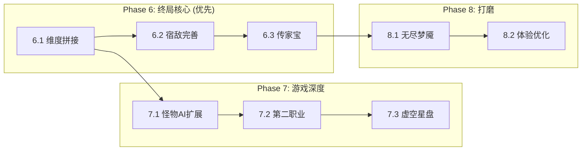

# NoMoreDay - 后续开发路线图 V1.0 (2026-01-13)

## 📊 当前进度总览

根据 `tracks.md` 和代码分析，以下是已完成和待实现的功能模块：

### ✅ 已完成 (Phase 1-5)
| 模块 | 状态 | 说明 |
|------|------|------|
| **C++20 ECS 骨架** | ✅ 完成 | EnTT + Taskflow 并发调度 |
| **渲染系统** | ✅ 完成 | Raylib 2D 渲染, CPU + GPU 混合 |
| **物理/碰撞** | ✅ 完成 | SpatialHashGrid 空间哈希 |
| **地图生成** | ✅ 完成 | 细胞自动机, 连通性检查, 战争迷雾 |
| **流场寻路** | ✅ 完成 | CPU 流场 + GPU 流场 (SSBO) |
| **物品/掉落系统** | ✅ 完成 | 词缀, 精炼, 掉落过滤器 |
| **战斗系统** | ✅ 完成 | 标签驱动伤害流水线, 暴击/护甲 |
| **技能系统** | ✅ 完成 | 剑修9技能, 专精树, 影分身, 召唤物 |
| **天赋星盘** | ✅ 完成 | 数据驱动, 解锁逻辑, UI 交互 |
| **Buff/Debuff** | ✅ 完成 | 状态管理, 视觉反馈 |
| **GPU 粒子系统** | ✅ 完成 | 20万粒子容量, <0.2ms 物理调度 |
| **GPU 技能特效** | ✅ 完成 | 水墨修仙风格 VFX |
| **UI 系统** | ✅ 完成 | 高DPI, 统一主题, 技能栏, 背包 |
| **敌人生成** | ✅ 完成 | 群聚生成, 精英词缀, 休眠系统 |
| **宿敌系统完善** | ✅ 完成 | Hunter AI, 进化闭环, 线程安全, 针对性进化 |
| **怪物 AI 扩展** | ✅ 完成 | Support, Assassin, Tank, SoulLink, Avenger |
| **存档系统** | ✅ 完成 | SerializationSystem (JSON) |

### 🔄 进行中 (Phase 5-6 过渡)
| 模块 | 状态 | 说明 |
|------|------|------|
| **GPU 流场集成** | 🔄 进行中 | 已重构为 SSBO, 需完成实际怪物寻路集成 |

---

## 🚀 后续开发计划 (Phase 6-8)

### 📍 Phase 6: 终局玩法核心 (预计 2-3 周)

这是设计文档中优先级最高的未实现内容，直接影响游戏的核心循环。

#### 6.1 维度拼接系统 (Dimensional Mosaic) - **高优先级**
**设计参考**: `设计文档/局外成长与终局玩法.md`

| 子任务 | 复杂度 | 描述 |
|--------|--------|------|
| **MapFragmentComponent** | ⭐⭐ | 地图碎片数据结构 (形状, 属性, 稀有度) |
| **FragmentDropSystem** | ⭐⭐ | 怪物掉落碎片逻辑 |
| **MosaicEditorState** | ⭐⭐⭐⭐ | 3x3 拼图编辑器 UI (拖放, 旋转) |
| **FragmentResonance** | ⭐⭐⭐ | 相邻碎片共鸣算法 (属性传播) |
| **MosaicMapGenerator** | ⭐⭐⭐ | 基于碎片配置的地图生成 |

**技术实现建议**:
- 碎片形状使用 Bitmask (2x3 网格 = 6bit)
- 共鸣算法参考 Dijkstra 传播
- 编辑器 UI 复用 `UIInventory` 的拖放逻辑

---

#### 6.2 传家宝系统 (Heirloom Vault) - **中优先级**
| 子任务 | 复杂度 | 描述 |
|--------|--------|------|
| **HeirloomComponent** | ⭐ | 标记装备为传家宝的组件 |
| **HeirloomVaultUI** | ⭐⭐⭐ | 在主菜单展示并选择传承装备 |
| **HeirloomScaling** | ⭐⭐ | 低等级时属性动态压缩公式 |
| **PersistentStorage** | ⭐⭐ | 扩展 `SerializationSystem` 支持跨存档 |

---

### 📍 Phase 7: 游戏深度 (预计 2 周)

#### 7.1 第二职业原型 - **中优先级**
**设计参考**: `设计文档/职业被动和技能设置.md`

设计文档中提到了多职业设计，但目前只实现了 **剑修 (Blade Ascendant)**。

| 子任务 | 复杂度 | 描述 |
|--------|--------|------|
| **职业框架抽象** | ⭐⭐ | 将剑修特有逻辑与通用技能系统解耦 |
| **第二职业设计** | ⭐⭐⭐⭐ | 例如: 符咒师 (投掷/陷阱) 或炼体修士 (近战/防御) |
| **职业选择 UI** | ⭐⭐ | 角色创建/选择界面 |

---

#### 7.3 虚空星盘 (Void Astrolabe) - **低优先级**
局外成长系统，提供账号共享的永久加成。

| 子任务 | 复杂度 | 描述 |
|--------|--------|------|
| **VoidAstrolabeRegistry** | ⭐⭐ | 全局天赋节点数据 (区别于角色星盘) |
| **StardustResource** | ⭐ | 通过高层/Boss 获取的货币 |
| **VoidAstrolabeUI** | ⭐⭐⭐ | 独立于角色星盘的 UI |

---

### 📍 Phase 8: 打磨与内容 (预计 2 周)

#### 8.1 无尽梦魇模式 (Eternal Nightmare) - **中优先级**
| 子任务 | 复杂度 | 描述 |
|--------|--------|------|
| **CorruptionSystem** | ⭐⭐ | 腐化值计算与词缀增强 |
| **InfiniteScaling** | ⭐⭐ | 怪物属性指数增长公式 |
| **LeaderboardSystem** | ⭐⭐⭐ | 本地/在线排行榜 (最高层数, 伤害峰值) |

---

#### 8.2 游戏体验优化
| 子任务 | 复杂度 | 描述 |
|--------|--------|------|
| **教程系统** | ⭐⭐ | 新玩家引导 |
| **成就系统** | ⭐⭐ | 解锁条件与奖励 |
| **音频系统** | ⭐⭐⭐ | 背景音乐, 技能音效, 动态混音 |
| **粒子池化** | ⭐⭐ | `GPUParticleSystem` 内存优化 |
| **自动图块拼接** | ⭐⭐ | 地图视觉升级 (Bitmasking Tileset) |

---

## 📋 推荐开发顺序

基于游戏核心玩法的依赖关系，推荐按以下顺序开发：



---

## 🔧 即时可开始的任务

以下任务可以立即启动，无需额外依赖：

### 1. **碎片掉落原型** (约 2-3 小时)
位置: `src/game/systems/item/`

```cpp
// MapFragmentComponent.hpp (新建)
struct MapFragmentComponent {
    uint8_t shape_bitmask;  // 俄罗斯方块形状 (6bit)
    FragmentType type;      // Terrain, Affix, Unique
    std::vector<std::string> modifiers;
    Rarity rarity;
};
```

### 2. **GPU 流场实际集成测试** (约 2-3 小时)
验证 `GPUFlowFieldSystem` 与 `AISystem` 的协作，确保怪物正确使用 GPU 计算的流场移动。

### 3. **维度拼接编辑器原型** (约 4-6 小时)
设计 `MosaicEditorState`，利用 `raylib` 实现简单的碎片拖放与 3x3 网格对齐逻辑。

---

## 📝 备注

- 所有新系统应遵循 `conductor/code_styleguides/general.md` 规范
- 复杂系统应配套单元测试 (在 `tests/` 目录)
- UI 开发优先使用 ImGui 原型，再迁移到自定义渲染

---

*文档生成日期: 2026-01-13*
*基于项目版本: tracks.md 最后更新 2026-01-09*
