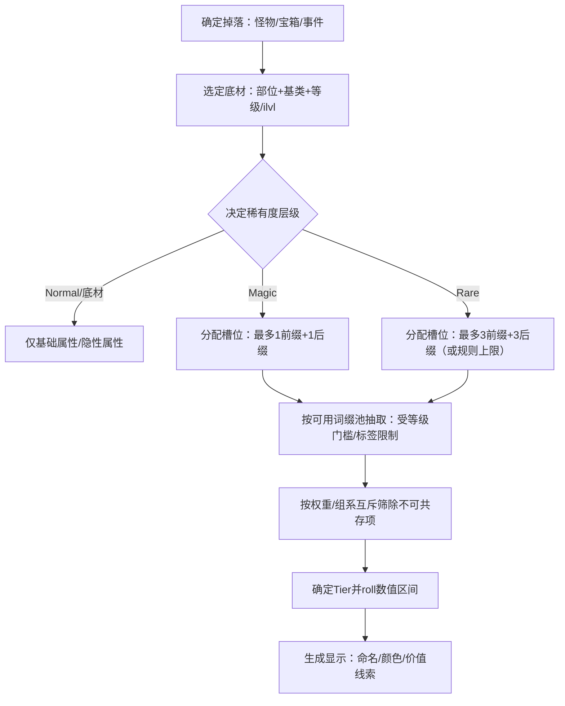

# 主流优秀 ARPG 装备系统设计深研报告（以资深系统设计分析师视角）

## 执行摘要

装备系统的本质，是把“刷怪—掉落—评估—优化—构筑—再挑战”的循环，压缩成可理解、可追逐、可社交/可自洽的长期动机。对比《暗黑破坏神2/3/4》《流放之路》《恐怖黎明》《Last Epoch》《火炬之光》可以看到三条主线：其一，以《流放之路》为代表的“高随机词缀深度 + 几乎完全可交易经济”，用交易与货币化制作把 RNG 拉到长期尾部，并通过“刻意摩擦的交易体验”守住掉落价值；其二，以《暗黑3》《暗黑4（Loot Reborn 后）》为代表的“传奇能力固定化 + 装备优化系统化”，把构筑重心从“识别词缀组合”转移到“收集/继承/打磨关键能力”，用更强的可控性换取更清晰的升级路径；其三，以《恐怖黎明》《Last Epoch》为代表的“自拾友好 + 定向追逐”，通过 MI/宝箱/预言/工匠预算（Forging Potential）等机制，把“可刷到”变成系统承诺，从而降低交易依赖并改善中长期留存体验。citeturn28view0turn18view2turn9view0turn24view2turn27view0

## 研究范围与分析框架

本报告只聚焦“装备系统”而非职业/战斗数值本体，拆解维度为：装备分级与稀有度结构、词缀系统（前后缀/权重/叠加与排斥/随机与固定）、传奇/独特装备哲学、掉落与获取（掉落率公开程度、交易/制造/任务活动）、以及装备对 Build 构筑与强度曲线的塑形方式。对于官方未公开的掉率/权重，遵循“未公开/社区估算”标注；并优先引用官方指南、设计宣言/开发者博文、支持中心条目等一手信息。citeturn13view0turn28view0turn24view1turn9view0turn18view0

## 各游戏装备系统核心设计逻辑拆解

下文按同一结构压缩呈现每款作品的“装备系统骨架”，强调其**底层动机**（想让玩家如何刷、如何选、如何优化、如何长期留存）。

**《暗黑破坏神2》（D2/D2R）**  
稀有度与分级：官方/Arreat Summit 给出从低到高的稀有大序为 Low Quality→Normal→High Quality→Magic→Rare→Set→Unique，这本质上把“基础底材—随机词缀—固定组合”分成三层，并允许玩家在不同层追求不同价值（例如底材的孔数/底材等级）。citeturn32view0  
词缀系统：Magic 物品最多 1 前缀+1 后缀，并给出“同时前后缀/仅前缀/仅后缀”的生成概率；Rare 物品拥有 2–6 条魔法属性，但同样受“最多 3 前缀/3 后缀”“同组互斥”“不重复选取”约束，且词缀可用 qlvl 与 ilvl 的关系做等级门槛（官方描述为从满足 qlvl<=ilvl+2 的集合中抽取）。该体系把“词缀空间”做得极深且强排斥，天然鼓励长期刷与交易估值。citeturn33view0turn16search16  
传奇/独特哲学：Unique/Set 以“固定词条组合 + 数值区间浮动”表达“主题性”；但设计上并不保证“唯一最强”，更多承担“玩法特性/里程碑”。citeturn16search15turn16search6  
掉落与获取：显式可控的渠道主要是**赌博、任务奖励、方块配方、符文之语底材**。例如赌博给出了 Magic/Rare/Set/Unique 的概率（用于设计参照时可视作“公开掉率样本”）；而 Larzuk 打孔奖励明确依赖底材与 ilvl，并对 Set/Rare/Unique/Crafted 强制 1 孔上限，形成“底材追逐”的独立终局线。citeturn16search5turn33view2  
构筑影响：D2 的 Build 强依赖“阈值型词条”（如施法/攻速/打击恢复等断点，属于系统层面的常识实践），同时符文之语通过“底材+配方”给出可规划的终局目标；并且官方明确符文之语只能用于“带孔的非魔法物品”，把“词缀随机层”与“配方合成层”分流，避免叠加导致的上限失控。citeturn34search2turn33view1turn33view2  

**《暗黑破坏神3》（D3）**  
稀有度与分级：D3 把“可用装备”主战场收敛到 Legendary/Set，并通过 Ancient/Primal Ancient 作为 Legendary 的“更高滚点版本”提供终局向上空间（本质是“相同模板 + 更高 roll 区间”的二次追逐）。citeturn36search0turn36search1  
词缀系统：D3 的词缀更偏“有限词条池 + 大数值滚动”，并将复杂度从“组合发现”转向“定向修正/重铸”。例如官方补丁说明 Loot 2.0 的 smart drop 会让部分产出更贴近角色需求（至少在制造品/掉落层面引导可用性）。citeturn2search3  
传奇/独特哲学：传奇与套装承担“构筑开关”的角色——大量套装/传奇特效直接改变技能倍率与玩法循环（从系统设计角度，这是把“Build 设计”从天赋树转移到**装备特效层**）。  
掉落与获取：D3 的关键不在公开掉率，而在“多渠道凑齐构筑件并反复刷 roll”。典型手段包括：血岩碎片（Blood Shard）驱动的赌博 NPC、以及卡奈魔盒对传奇的重铸能力（官方预览明确：重铸会像“新掉落一样完全随机化属性并移除附魔痕迹”）。同时交易被强约束（社区/官方论坛常见规则为仅限同局短时窗口分享），从而把长期目标锁定在“自刷+赛季循环”。citeturn2search2turn30search5turn22search14  

**《暗黑破坏神4》（D4，Loot Reborn 及之后的“装备旅程”）**  
稀有度与分级：Loot Reborn 的关键变化不是增加新稀有度，而是**降低掉落物品的有效复杂度**，把“识别难度”转移到“后处理打造系统”。官方明确将 Legendary 词缀条数降至 3、Rare 降至 2，并提高词缀有效性；同时减少总体掉落数量，以缩短“捡垃圾—筛选”时间。citeturn17view0turn18view2  
词缀与打造：D4 的核心创新是“把能力拆出来，变成可继承/可升级的模块化系统”。Season 4 之后，官方说明分解 Legendary 可把力量存入 Codex of Power，并可通过分解更高数值版本来升级，同一力量可重复使用；Tempering 通过“手册（Manual）的小集合词条”给装备附加词缀，并以耐久/次数约束避免无限试错；Masterworking 作为终局强化，提升词缀整体强度，并在每 4 级对某条词缀进行“显著强化”，且允许重置重来。citeturn18view0turn18view3  
更近期的系统走向（体现设计意图）：2.5.0 PTR（面向下一赛季的测试）进一步把 Tempering 推向“总能选到目标词条、并可无限恢复次数”，并强调 Masterworking 的“更线性路径”；这表明 D4 正持续把“随机性”从**是否得到想要词条**迁移到**材料成本/终局重置与迭代**上。citeturn37view0turn17view1  
掉落与交易：D4 的交易被官方支持条目严格限定：可交易仅包括未附魔的普通/魔法/稀有装备，以及金币、宝石、药剂；传奇/独特、附魔物品、Aspects 等不可交易。这会把“终局追逐”强行收敛为自刷与打造系统，而不是经济博弈。citeturn21search2  
构筑影响：D4 的 Build 更像“技能树/巅峰底盘 + Aspects/Unique 把玩法定型 + Tempering/Masterworking 把强度打磨到位”。系统收益是“更可读、更可控”，代价是“交易驱动的长尾稀缺感”被压缩，留存更多依赖赛季内容与打造材料循环。citeturn18view0turn18view3turn21search2  

**《流放之路》（PoE）**  
稀有度与分级：官方 Items 页明确：Magic 物品的 Mods 以前后缀形式出现，最多 1 前缀+1 后缀；Rare 物品最多 6 条随机 Mods（3 前缀+3 后缀）。这是一种“硬槽位上限”设计，用极低成本保证系统可读性与可交易估值的稳定框架。citeturn13view0  
词缀系统（深度核心）：PoE 的“深”主要来自三点：其一，词缀具备权重（weight）并以“权重/总权重”形成概率比；其二，词缀带标签与组系（mod family/group）形成互斥/阻断与制作策略空间；其三，货币化制作手段极多，使得“随机”可被分阶段操控（从系统观看，就是把一次性大 RNG 拆成多步小 RNG）。权重机制是权威社区明确的基础概念（官方数据多通过数据表/工具呈现），适合作为“可解释概率”的设计工具。citeturn35search0turn14view0  
传奇/独特哲学：PoE 的 Unique 既承担“Build 关键开关”，也承担“经济分层”（强/弱 Unique 共存，形成早中晚期价值梯度）。社区/官方都强调“items matter”，其核心不是让 Unique 永远最强，而是让“掉到的东西可以被估值、被交换、被转化为未来 Build 的可能性”。citeturn28view0turn13view0  
掉落与获取（交易是系统的一部分）：官方直说 PoE 没有金币制，而是掉落各类 Currency Items 来修改装备；这些货币既可自用强化角色，也可与玩家或 NPC 交易。Trade Manifesto 进一步把“几乎不绑定”上升为设计支柱，并明确指出：如果交易过于便利，会导致角色通过交易而非打怪升级、并迫使掉率被动下调以维持难度与目标寿命。换言之，PoE 把“交易摩擦”当成掉落价值与留存曲线的调节阀。citeturn13view0turn28view0  
构筑影响：装备并非只是堆伤害，而是解决抗性、生命/护盾、技能链接与触发/施放形式等“可运行性条件”；交易驱动下，Build 构筑往往呈现“先凑能跑的功能装→再用经济迭代逼近理想词缀组合”的阶梯式强度曲线（典型长尾）。citeturn28view0turn13view0  

**《恐怖黎明》（Grim Dawn）**  
稀有度与分级：官方指南把装备层次拆得很清楚：Common 是词缀承载底材；Magic 是底材滚到魔法品质前后缀；Rare 是滚到至少一个稀有品质词缀，并允许 Magic/Rare 混搭；“双稀有（double rare）”被官方点名为可能是最强装备之一。citeturn9view0  
词缀系统与 MI：Grim Dawn 的标志性设计是 Monster Infrequents（MI）：只从特定怪掉落、且并非 100% 掉率；MI 自带基础属性，同时还能像普通底材一样继续滚词缀，因此“好底材 + 好词缀”形成可定向刷的长期目标。citeturn9view0  
传奇/独特哲学：Epic/Legendary 属于“预设属性组合的独特装备”，常包含主动/被动技能效果；但系统整体并不强迫“套装一统天下”，而是鼓励通过 MI/词缀/组件/遗物去拼出伤害类型与抗性拼图。citeturn9view0turn6view1  
掉落与获取：官方明确表达其设计立场：不要求玩家依赖拍卖行/交易来毕业，而是调校掉率让普通玩家在合理时间内积累收藏；同时强化探索与宝箱回报，甚至设置“一次性宝箱”保证史诗掉落。制造侧，黑匠打造被定义为“填补装备空缺”，并加入黑匠专长加成；蓝图一经学习可长期解锁并跨角色共享（Normal/Hardcore 分表）。citeturn9view0turn10view0  
构筑影响：系统用“可定向刷 MI + 可控补齐（组件/增强/制造）”让玩家更容易把 Build 从概念跑到可用；其强度曲线更平滑、少经济焦虑，但相对缺少“交易驱动的无限追逐尾部”。citeturn9view0turn6view1turn10view0  

**《Last Epoch》**  
稀有度与分级：终局的关键追逐被分成两条：Exalted（高阶词缀/高 Tier）与 Unique（机制性）；Legendary 则通过系统把两者“拼装”为更高阶追逐。官方支持条目给出 Legendary 的硬规则：需要带 Legendary Potential（LP，1–4）的 Unique + 同类型且“恰好 4 条未封印词缀”的 Exalted，通过 Temporal Sanctum 的 Eternity Cache 合成，合成后继承 Unique 本体并从 Exalted 抽取等同 LP 数量的词缀；并且在更高层级可指定至少 1 条必定转移，其余随机。citeturn24view1turn24view2  
词缀与制作（“预算式可控随机”）：Last Epoch 的 crafting 核心是 Forging Potential（FP，制作预算）与符文/雕文工具链：例如 Glyph of Hope 提供一定概率不消耗 FP；Glyph of Chaos 会在升级词缀后把它随机变成同槽位可出现的另一词缀；Glyph of Despair 则可能把词缀“封印”到独立槽位，为装备扩展出额外词缀空间但封印后不可再改。这个体系把“试错”变成一种可计算的资源决策，而不是纯粹赌脸。citeturn24view0turn24view2  
掉落与获取（双极化立场）：Last Epoch 用 Item Factions 把“交易党”和“自拾党”系统化。官方明确：Merchant’s Guild 允许同阵营玩家在同赛季/模式内交易，交易只用金币（禁止以物易物），并以 Favor/Rank 控制交易权限；Bazaar 支持异步交易。Circle of Fortune 则强化自拾与预言（Prophecies），且在该阵营下获得的物品通常不可交易（但可赠礼），并可能绑定阵营导致换阵营后无法穿戴。赠礼系统则允许同区域共同掉落的物品“无时限、无成本”赠送给当时在场的队友。citeturn27view0turn27view1turn27view2turn27view3  
构筑影响：Legendary 系统的“设计目标”被开发者写得很直白：把机制很酷但数值不足的 Unique 带进终局，同时不让 Exalted 与既有 crafting 失去价值；并强调这是把多个大掉落“以可感知的进度”拼成一个大目标。LP 的具体概率公式官方明确“不计划公开”，且 LP 与 Unique 基础强度关联（越强的 Unique 越难出 LP），这是典型的“稀缺度随潜在强度自适应”的平衡手段。citeturn24view2turn24view1  

**《火炬之光》（以 Torchlight II 为代表）**  
稀有度与分级：社区资料总结了 TL2 的质量色阶：Common（白）→Enchanted/魔法（绿，随机附魔）→Rare（蓝，更多随机附魔，可能属于套装）→Unique（金/橙，固定命名与固定附魔）→Legendary（橙红，最高阶，极稀有，多为武器/盾且具独特属性）；并保留“套装 bonuses 固定，但单件属性可有随机性”的混合形态。citeturn23view0turn23view2  
掉落与获取：社区明确给出 Legendary 的掉落概率（Boss/精英更高、普通怪更低）并指出可从赌徒处获取；同时套装以“件数阈值”持续给奖励，推动中期阶段性收集。该系统整体更偏轻量爽刷，靠稀有度颜色与套装阈值提供清晰目标，但词缀深度与终局打磨链条相对有限。citeturn23view1turn23view2  

下面给出一个“典型词缀生成管线”（适用于 D2/PoE/Grim Dawn 这类前后缀体系），用于对齐比较思路：D2 强调 qlvl/ilvl 门槛与组系互斥，PoE 强调前后缀槽位与权重，Grim Dawn 把“底材→词缀→（MI：底材自带属性）”写进官方指南。citeturn33view0turn13view0turn35search0turn9view0



## 差异对比与典型流派

### 关键维度比较表

| 游戏 | 稀有度结构与终局载体 | 词缀模型重心 | 传奇/独特的“构筑权力” | 获取与优化主循环 | 交易/经济取向 |
|---|---|---|---|---|---|
| 暗黑2 | Set/Unique + 符文之语底材 + Rare 长尾；稀有序公开 | qlvl/ilvl 门槛、组系互斥、Rare 最多 3/3 | 符文之语把“配方=里程碑”，Unique/Set 更偏主题性 | 刷底材/符文→做符文之语；刷词缀→估值/替换 | 官方允许交易/转移但非系统化市场；经济由社区自组织（掉率未公开）citeturn32view0turn33view0turn34search2 |
| 暗黑3 | Legendary/Set 为核心；Ancient/Primal 提供二次追逐 | 词缀池较收敛，强调重铸/附魔 | 装备特效与套装倍率主导 Build | 速成套装→反复刷更好 roll/更高阶版本→冲层 | 交易强限制，留存靠赛季循环与roll追逐citeturn36search0turn30search5turn22search14 |
| 暗黑4 | 掉落先“减负”，复杂度转移到 Temper/Masterwork；Greater Affix 强化稀缺感 | 手册小池定向加词条 + 终局打磨/可重置 | Aspects 编码进 Codex，可升级并反复使用 | 掉落更少更精→存/升级 Aspect→Tempering→Masterworking | 交易仅限低阶与未附魔稀有，传奇/独特不可交易citeturn18view0turn18view3turn21search2turn37view0 |
| 流放之路 | Rare/Unique + 深制作生态；货币同时是“钱”和“加工” | 前后缀槽位硬上限 + 权重 + 标签/组系策略空间 | Unique 一部分启用 Build，一部分做经济分层 | 刷货币/底材→制作/交易→迭代升级，交易摩擦用来守住掉率与升级步数 | 几乎不绑定；交易是核心支柱但“不能太容易”citeturn13view0turn28view0turn35search0 |
| 恐怖黎明 | 自拾友好：MI + Rare（含 double rare）+ Epic/Legendary | 底材承载词缀；Rare 可混搭；MI=定向底材+随机词缀 | 独特装常带技能效果但不必碾压词缀装 | 定向刷 MI/宝箱→组件/制造填缺口→逐步完善抗性/伤害拼图 | 官方明确不要求拍卖/交易来毕业，强调合理时间内自拾citeturn9view0turn10view0turn6view1 |
| Last Epoch | Exalted 与 Unique 并行；Legendary=两者拼装；LP 稀缺自适应 | FP 预算式制作 + 符文/雕文控制随机；封印扩展槽位 | Unique 提供机制，LP+拼装把它带进终局 | 刷 LP Unique + 优质 Exalted→Temporal Sanctum 合成→继续刷材料/预言 | 物品阵营二选一：交易（MG）或自拾增益（CoF），并以绑定/Rank 控制外溢citeturn24view1turn24view0turn27view0turn27view2turn24view2 |
| 火炬之光2 | 清晰色阶：随机附魔为主，套装阈值收集 | 轻量随机附魔 | Unique/Legendary 更偏稀有爽点与主题性 | 刷怪/赌徒→偶发传奇/套装件→阶段性成型 | 经济/交易不是核心叙事（掉率多为社区整理）citeturn23view0turn23view1turn23view2 |

### 差异的流派归纳

从系统风格上，我通常把这些装备体系归为三种“典型流派”，它们对应不同的玩家心智与产品定位：

高随机性 + 交易驱动：以 PoE 为代表，把“掉落价值”外化为经济流通，并把交易摩擦作为调参旋钮；玩家行为会自然分化为“刷货币/刷专精内容—卖出—买入—迭代”，Build 构筑像投资组合。citeturn28view0turn13view0

固定传奇能力 + 构筑限定：以 D3 与 D4（Loot Reborn 后）为代表，把构筑关键从“凑词缀”改为“收集/继承/打磨能力模块”，优点是可读性强、上手顺滑、赛季回流成本低；缺点是当能力模板稳定后，长期追逐更依赖材料循环与新赛季供给。citeturn18view2turn36search0turn37view0

自拾友好 + 定向追逐：以 Grim Dawn、Last Epoch 为代表，通过 MI/预言/预算制作/拼装传奇等机制，承诺“我只靠玩也能稳步接近目标”。它牺牲部分经济带来的长尾，但换来更好的单机/轻社交留存与挫败控制。citeturn9view0turn27view2turn24view2

## 可复用装备设计模式

以下模式以“可迁移”为目标，每条都给出驱动效果与典型落地样例。

**模式：前后缀槽位硬上限（Slot Cap）**  
适用场景：需要让随机词缀系统“深但可读”，并保证交易估值稳定（玩家能快速判断“前缀/后缀是否满”“还差什么槽位”）。实现要点：规定 Magic/Rare 的前后缀上限；配套“组系互斥/不重复”规则避免同质堆叠；必要时在 UI 上显式提示槽位占用。优缺点：优点是可解释、可控上限、利于经济；缺点是可能限制“奇观装备”出现频率，需要用 Unique/合成系统承载突破感。玩家行为：促使玩家以“补槽”思维迭代装备，形成稳定的中期目标链。示例：PoE 官方明确魔法最多 1+1，稀有最多 3+3；D2 也明确稀有最多 3 前缀/3 后缀且组系互斥。citeturn13view0turn33view0  

**模式：权重化随机（Weighted RNG）与“可解释概率”**  
适用场景：词缀池很大，且你希望稀缺词条既能保持“稀有感”，又能在系统上可被工具化理解（社区工具/内置百科）。实现要点：为每个候选结果定义权重，并允许通过标签/环境修正权重；同时提供可追溯的“为何不能出/为何很难出”解释通道。优缺点：优点是可微调稀缺度并支持多路径操控；缺点是学习成本高，且玩家一旦掌握工具会把游戏优化为“概率工程”。玩家行为：驱动“研究—模拟—制作—交易”的元玩法。示例：PoE 社区将 weight 定义为“相对概率比”，并用权重/总权重表达某词缀出现概率。citeturn35search0  

**模式：能力模块化继承（把“传奇能力”从装备上剥离成库）**  
适用场景：需要降低掉落筛选负担、减少“为了能力不得不换底材”的挫败，并强化“收集进度”。实现要点：允许分解/提取装备能力进入永久/半永久库；允许用更高 roll 的同能力升级库；把随机性从“是否掉到能力”转移到“掉到更高 roll / 更好底材”。优缺点：优点是新手更容易做出可玩 Build，回流更顺；缺点是掉落惊喜被削弱，且容易走向“能力毕业后只剩数值打磨”。玩家行为：从“捡到就可能换装”转为“把能力收进收藏，再决定装配”。示例：D4 Season 4 明确分解传奇会把力量存入 Codex，并可通过分解更高数值版本升级，且可无限次复用。citeturn18view0  

**模式：预算式制作（Crafting Budget）+ 工具链控制随机**  
适用场景：你想让玩家“能靠制作接近目标”，但又不希望完美制作变成无限试错。实现要点：引入制作预算（如 FP），每次操作消耗预算；提供不同雕文/符文分别实现“省预算、换词条、封印扩槽”等效果，把风险拆分为可选择的策略。优缺点：优点是让制作具有策略手感、降低纯赌徒挫败；缺点是系统复杂度高，需要强 UI 与教程。玩家行为：驱动“先做可用装→再用预算冲上限→预算耗尽则换胚子”的可预期循环。示例：Last Epoch 的 Glyph of Hope（概率免 FP）、Glyph of Chaos（升级后随机换词缀）、Glyph of Despair（概率封印并腾出槽位）等工具链。citeturn24view0turn24view2  

**模式：定向底材（Targetable Base）+ 随机词缀叠加**  
适用场景：你想在“完全随机掉落”和“完全可制造”之间，提供一个可刷的长期目标，让玩家感觉“努力方向明确”。实现要点：定义某类装备只从特定怪/事件掉落，且带固定基础属性；其上仍可滚常规词缀，形成“底材定向 + 词缀随机”的双层追逐。优缺点：优点是把刷图行为与目标绑定，提高行动效率感；缺点是若底材过强会挤压其他掉落价值，需控制掉率与词缀池。玩家行为：自然形成“刷某 Boss/某区”的路线与社群知识传播。示例：Grim Dawn 官方定义 MI 只从特定怪掉落、非 100% 掉率，且自带基础属性并可继续滚词缀。citeturn9view0  

**模式：双极化阵营式获取（Trade vs Self-found Factions）**  
适用场景：同一款游戏同时服务“交易党”和“自拾党”，但不想让交易把掉落系统完全架空。实现要点：用阵营/规则在系统层切分两条路径：交易阵营提供市场与过滤能力，并用费用/声望/阶级限制高端交易；自拾阵营提供更强掉落/定向预言，但产出绑定、不可交易；提供赠礼机制保留朋友协作。优缺点：优点是让两类玩家都感觉“系统为我设计”；缺点是需要非常严谨的绑定与边界规则，否则会被套利。玩家行为：驱动玩家在角色层做策略选择，并形成“交易角色/自拾角色”的账号生态。示例：Last Epoch 的 Merchant’s Guild（金币+Favor+Rank、异步 Bazaar）与 Circle of Fortune（预言增强掉落、产出不可交易但可赠礼）。citeturn27view0turn27view2turn27view3turn27view4  

为便于理解“双极化获取 + 合成传奇”的整体闭环，下图用 mermaid 把 Last Epoch 的关键路径串起来（阵营决定“如何拿到装备”，Legendary 决定“如何把两类大掉落拼成终局目标”）。citeturn27view0turn27view2turn24view1turn24view2

```mermaid
flowchart LR
  subgraph A[获取路径：阵营选择]
    MG[Merchant's Guild] -->|Favor+Gold| BZ[Bazaar异步买卖]
    COF[Circle of Fortune] --> PR[Prophecies定向触发掉落]
    COF -->|在场掉落| GIFT[无成本赠礼]
  end

  subgraph B[终局拼装：Legendary]
    UQ[Unique (LP1-4)] --> TS[Temporal Sanctum]
    EX[Exalted (4未封印词缀)] --> TS
    TS --> EC[Eternity Cache合成]
    EC --> LG[Legendary=Unique本体+转移LP数量词缀]
  end

  BZ --> UQ
  BZ --> EX
  PR --> UQ
  PR --> EX
```

## 各游戏主要优缺点与对长期留存的影响

**D2** 的优势在于：词缀空间深、底材与符文之语提供可规划长线目标、交易/社群估值天然形成“另一套游戏”；代价是学习成本与挫败阈值高，且当符文之语成为通用最优解时会压缩部分多样性（这属于“配方型终局”常见副作用）。citeturn33view0turn34search2turn33view1  

**D3** 的优势在于：构筑成型快、赛季循环回流成本低、通过“更高阶同模板”维持可刷性；代价是套装/传奇特效主导会使可替代性下降（强依赖指定件），并且交易受限使留存更依赖内容更新与刷层目标，而不是经济生态。citeturn36search0turn30search5turn22search14  

**D4（Loot Reborn 后）** 的优势是：掉落可读性与筛选负担显著优化，复杂度被搬到 Tempering/Masterworking/Codex 的可控系统里，有利于中度玩家形成“可走通的装备旅程”；代价是交易严格限制，使得“我刷到的无用极品能变现”的动机较弱，长期留存更依赖赛季内容与打造材料循环是否足够耐刷。citeturn18view2turn18view0turn21search2turn37view0  

**PoE** 的优势在于：装备—货币—交易形成自洽生态，设计者甚至把“不能太容易的交易”当作维持掉落价值与升级步数的核心手段；代价是高门槛与高摩擦带来的疲劳风险（尤其在高度优化玩家中更明显），且系统复杂度需要长期内容供给来抑制“解题感”。citeturn28view0turn13view0turn35search0  

**Grim Dawn** 的优势是：官方明确目标是让玩家无需依赖拍卖/交易也能在合理时间内自拾积累，并用 MI/宝箱/制造等机制把“定向追逐”落地；代价是缺少交易经济带来的社交估值长尾，留存更多依赖玩法本体深度、Build 多样性与资料片内容。citeturn9view0turn10view0  

**Last Epoch** 的优势是：预算式制作与 Legendary 拼装让“确定性进度”更强，Item Factions 直接把玩家偏好系统化并控制套利边界；代价是系统层级多、规则复杂，对 UI/教程与数值平衡提出更高要求（尤其是 LP 稀缺自适应的分布需要持续调参）。citeturn24view2turn27view1turn24view1  

**Torchlight II** 的优势是：稀有度色阶清晰、套装阈值收集直观、偶发传奇提供强爽点；代价是词缀与终局打磨链条较短，因此长期留存更依赖关卡节奏、重复刷体验与（历史上）模组生态，而非装备系统自身的无限尾部。citeturn23view0turn23view1turn23view2  

## 总结与原创 ARPG 装备设计启发

综合观察，当前主流 ARPG 装备设计大致收敛为几种核心范式：

面向硬核长线的“经济型装备范式”：以 PoE 为典型，前后缀槽位上限保证可读性，权重/标签/制作生态保证深度，交易摩擦保证掉落价值与进度寿命；适合**高在线、赛季制、内容迭代频繁**的产品，也更容易与 QoL 型商业化（仓库、交易便利等）形成联动。citeturn28view0turn13view0turn12search7  

面向更广泛玩家的“能力模块化范式”：以 D4（以及部分 D3 思路）为典型，把构筑关键转为可收集、可继承、可打磨的能力模块，让掉落筛选更轻、升级路径更线性；适合**重视回流、强调可读性、希望降低挫败**的产品，商业上更依赖赛季内容与外观驱动而非经济生态。citeturn18view2turn18view0turn21search2turn37view0  

面向自拾与单机/轻社交的“定向追逐 + 预算制作范式”：以 Grim Dawn 的 MI/宝箱/制造与 Last Epoch 的 FP 制作/预言/Legendary 拼装为典型，把“随机”变成可规划的多段目标；适合**买断制或轻服务化**、强调 Build 实验与自我进度感的产品。citeturn9view0turn10view0turn24view0turn24view2turn27view2  

对原创 ARPG 的实践建议（偏系统落地）：首先，尽早明确你要服务的“装备心智”——是“我想研究概率套利（PoE）”，还是“我想快速成型再精炼（D4/D3）”，或是“我只想靠自己定向刷到并逐步完善（Grim Dawn/LE）”。其次，把随机性放在**你希望玩家愿意重复的环节**：如果战斗爽而筛选痛苦，就该像 D4 一样减少掉落复杂度并把深度挪到打造；如果你需要经济生态，就要像 PoE 一样把交易规则当成掉率与进度寿命的调参阀；如果你要自拾友好，就要像 MI/预言/拼装那样给玩家“明确努力方向”。最后，无论选择哪条范式，都建议保留至少一种“可感知进度的超级目标”（配方型、拼装型、打磨型皆可），因为它是留存曲线最稳定的锚点。citeturn18view2turn28view0turn24view2turn9view0