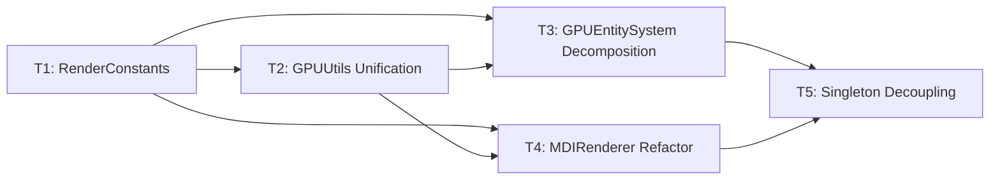

# GPU 渲染管线重构技术路线图 (V1.0)

> **项目代号**: `rendering_pipeline_refactor`
> **依据**: `conductor/analyzer/gpu_rendering_pipeline_audit_20260126.md`
> **创建日期**: 2026-01-26
> **预计总工期**: 5-6 个开发周期 (约 20-30 工作日)

---

## 1. 背景与目标

### 1.1 问题概述

根据架构审计报告，当前 GPU 渲染管线存在以下严重问题：

| 问题类型 | 严重程度 | 核心问题 |
|---|---|---|
| **DOD 违规** | 🔴 Critical | `GPUEntitySystem::Update` 热循环中多次 `try_get`，破坏缓存一致性 |
| **架构缺陷** | 🔴 Critical | `MDIRenderer` 手动加载 OpenGL 函数指针，与 `GPUUtils` 重复 |
| **安全隐患** | 🟠 Major | SSBO Binding Index 使用魔法数字，易产生静默损坏 |
| **低内聚** | 🟠 Major | `MDIRenderer::Get()` 单例滥用，耦合度高，单元测试困难 |
| **职责混乱** | 🔴 Critical | `GPUEntitySystem::Update` 混合物理、纹理选择、AI 状态打包、属性同步 |

### 1.2 重构目标

本重构计划旨在达成以下工程目标：

1. **代码一致性**: 建立统一的 GPU 资源抽象层、绑定常量命名空间。
2. **性能优化**: 严格遵循 DOD 原则，分离数据更新路径，提升缓存命中率。
3. **安全健壮性**: 消除魔法数字，定义类型安全的 Binding Index 常量。
4. **可测试性**: 打破 Singleton 耦合，引入依赖注入，支持独立单元测试。
5. **可扩展性**: 模块化 `GPUEntitySystem`，为未来渲染特性（如 GPU Skinning）预留接口。
6. **向后兼容**: 采用渐进式迁移，每阶段可独立测试、独立回滚。

---

## 2. Track 总览

本路线图拆分为 **5 个 Track**，每个 Track 聚焦单一职责：

| Track ID | 名称 | 依赖 | 状态 | 风险 |
|---|---|---|---|---|
| **T1** | `render_constants` | 无 | 🟢 已完成 | 低 |
| **T2** | `gpu_utils_unification` | T1 | 🟢 已完成 | 中 |
| **T3** | `gpuEntitySystem_decomposition` | T1, T2 | 🟢 已完成 | 高 |
| T4 | `mdi_renderer_refactor` | T1, T2 | 🟢 已完成 | 中 |
| **T5** | `singleton_decoupling` | T3, T4 | 🔵 待开始 | 高 |

---

## 3. Track 详解

### Track 1: `render_constants` (绑定常量标准化)

**目标**: 消除所有渲染 SSBO/Buffer 绑定中的魔法数字。

**核心产出**:
- `src/engine/render/RenderConstants.hpp`: 中央命名空间，定义所有 Buffer Binding Index。

**技术选型**:
- 使用 `enum class Binding : uint32_t` 确保类型安全。
- 审计所有 Compute Shader `.compute` 文件和 Vertex/Fragment Shader，统一 `layout(binding = X)` 与 C++ 端定义。

**里程碑**:
1. [x] 创建 `RenderConstants.hpp`。
2. [x] 重构 `MDIRenderer.cpp` 使用常量。
3. [x] 重构 `GPUEntitySystem.cpp` 使用常量。
4. [x] 审计并更新所有 Compute Shader。

**风险评估**: 低 (非破坏性变更，仅符号替换)。

---

### Track 2: `gpu_utils_unification` (GPU 工具层统一)

**目标**: 统一 OpenGL 扩展函数加载，消除 `MDIRenderer.cpp` 中的重复代码。

**核心产出**:
- 扩展 `GPUUtils.hpp`，增加 `DrawArraysIndirect`, `BindBuffer`, `ActiveTexture` 封装。
- 删除 `MDIRenderer.cpp` 中的手动 `glfwGetProcAddress` 调用。

**技术选型**:
- 所有 GL 扩展函数指针在 `GPUUtils` 内部静态缓存，仅加载一次。
- 对外接口使用类型安全的枚举参数 (如 `GPUUtils::MemoryBarrier(Barrier::Command | Barrier::SSBO)`)。

**里程碑**:
1. [x] 扩展 `GPUUtils` 添加 Indirect Draw / Buffer Bind API。
2. [x] 定义 `Barrier` 枚举以替换 `GL_xxx_BIT` 宏。
3. [x] 重构 `MDIRenderer.cpp` 移除手动加载代码。
4. [x] 确保 `ComputeBuffer::Bind/BindBase` 也通过 `GPUUtils` 调用。

**风险评估**: 中 (已完成，Iris Xe 验证通过)。

---

### Track 3: `gpuEntitySystem_decomposition` (职责分解)

**目标**: 将 `GPUEntitySystem::Update` 拆分为多个独立阶段，遵循 DOD 原则。

**核心产出**:
- `GPUPhysicsSyncJob`: 仅负责 Position/Radius → `GPUEntity` 的线性同步。
- `GPUVisualSyncJob`: 负责 CombatStats, Buffs, TextureIndex 等低频/脏标记驱动的同步。
- `GPUEntitySystem` 作为 Facade，编排上述 Job 的执行顺序。

**技术选型**:
- 使用 EnTT `group` (非冲突 Owned Group) 或分离的 `view` 实现线性访问。
- `GPUVisualSyncJob` 支持 Dirty Flag (`StatsDirty` Component) + 周期性刷新 (每 5 帧)。
- 优先使用 `memcpy` 批量上传，避免逐元素拷贝。

**里程碑**:
1. [ ] 定义 `GPUPhysicsSyncJob` 结构与接口。
2. [ ] 抽取物理更新逻辑到 `GPUPhysicsSyncJob`。
3. [ ] 定义 `GPUVisualSyncJob` 结构与接口。
4. [ ] 抽取视觉/状态更新逻辑到 `GPUVisualSyncJob`。
5. [ ] 在 `GPUEntitySystem::Update` 中编排两个 Job。
6. [ ] 性能基准测试 (目标: 20k 实体 < 2ms)。

**风险评估**: 高 (重构核心系统，需充分测试)。

---

### Track 4: `mdi_renderer_refactor` (MDI 渲染器规范化)

**目标**: 使 `MDIRenderer` 成为纯粹的渲染执行器，移除所有 GL 扩展加载代码。

**核心产出**:
- `MDIRenderer` 仅封装 VAO/VBO 管理和 Indirect Draw 调用。
- 所有 Buffer Binding 使用 `RenderConstants`。
- 所有 GL 调用通过 `GPUUtils` 代理。

**技术选型**:
- 引入构造函数/Init 方法接收 `GPUUtils&` 或使用静态类 (当前模式)。
- 保留 Singleton `Get()` 但计划在 T5 中消除。

**里程碑**:
1. [x] 替换所有魔法数字为 `RenderConstants::Binding::*`。
2. [x] 删除 `glDrawArraysIndirect`, `glBindBuffer` 等本地函数指针。
3. [x] 调用 `GPUUtils::DrawArraysIndirect`, `GPUUtils::BindBuffer`。
4. [x] 验证 Cull/Render 流程正确性。

**风险评估**: 中 (影响核心渲染路径，需视觉/性能验收)。

---

### Track 5: `singleton_decoupling` (单例解耦与依赖注入)

**目标**: 降低 `GPUEntitySystem` 和 `MDIRenderer` 的耦合度，支持单元测试。

**核心产出**:
- 引入 `IRenderContext` 接口 (或直接使用 `GPUEntitySystem`/`MDIRenderer` 的引用)。
- `GameplayState` / `Game.cpp` 负责实例化并注入依赖。
- 移除 `::Get()` Singleton 模式，改为成员引用。

**技术选型**:
- **非虚拟接口 (NVI)**: 避免虚函数开销，使用模板参数注入（如果测试框架支持）。
- **测试替身**: 提供 `MockRenderer` 用于单元测试，可跳过 GL 调用。

**里程碑**:
1. [ ] 定义 `RenderContext` 结构 (持有 `GPUEntitySystem`, `MDIRenderer` 引用)。
2. [ ] 修改 `GameplayState` 接受 `RenderContext` 注入。
3. [ ] 逐步移除 `::Get()` 调用点 (使用 `grep` 查找)。
4. [ ] 创建 `MockGPUEntitySystem` 用于测试。
5. [ ] 验证所有现有测试通过。

**风险评估**: 高 (涉及全局架构调整，需细致回归测试)。

---

## 4. 验收标准 (Acceptance Criteria)

| 标准 | 验证方式 |
|---|---|
| **无魔法数字**: 所有 `.cpp/.compute` 文件中 `Binding 0-3` 等字面量消失 | `Select-String -Path '*.cpp','*.compute' -Pattern 'Binding.*[0-3]'` 返回空 |
| **GPUUtils 单一入口**: `MDIRenderer.cpp` 无 `glfwGetProcAddress` 调用 | `Select-String -Path 'MDIRenderer.cpp' -Pattern 'glfwGetProcAddress'` 返回空 |
| **性能达标**: 20k 实体 Render < 2ms (集成显卡) | `GPURenderBenchmark` 测试 |
| **测试覆盖**: 新增 `GPUPhysicsSyncTest`, `GPUVisualSyncTest` | 测试通过 |
| **编译无警告**: `/W4` 编译通过 | 构建日志 |

---

## 5. 迁移策略

1. **渐进式迁移**: 每个 Track 完成后可独立合并 `main`，无需等待后续 Track。
2. **Feature Flag**: (可选) 对于 T3 的 Job 拆分，可在开发期使用 `#define USE_NEW_SYNC_JOBS` 开关。
3. **回滚计划**: 每个 Track 完成时标记 Git Tag (如 `render_refactor_T2_complete`)。

---

## 6. 时间估算

| Track | 预计工时 | 备注 |
|---|---|---|
| T1: RenderConstants | 4h | 机械性重构 |
| T2: GPUUtils Unification | 8h | 已完成 |
| T3: GPUEntitySystem Decomposition | 16-24h | 核心高风险 |
| T4: MDIRenderer Refactor | 8h | 依赖 T1, T2 |
| T5: Singleton Decoupling | 16h | 全局影响 |
| **合计** | **52-60h** | |

---

## 7. 附录: 文件影响矩阵

| 文件 | T1 | T2 | T3 | T4 | T5 |
|---|:---:|:---:|:---:|:---:|:---:|
| `RenderConstants.hpp` (新) | ✅ | | | | |
| `GPUUtils.hpp/cpp` | | ✅ | | | |
| `GPUEntitySystem.hpp/cpp` | ✅ | | ✅ | | ✅ |
| `MDIRenderer.hpp/cpp` | ✅ | ✅ | | ✅ | ✅ |
| `ComputeBuffer.hpp` | | ✅ | | | |
| `PersistentBuffer.hpp` | | ✅ | | | |
| `GameplayState.cpp` | | | | | ✅ |
| `Game.cpp` | | | | | ✅ |
| `*.compute` (Shaders) | ✅ | | | | |

---

*路线图版本: 1.1*
*最后更新: 2026-01-26*
