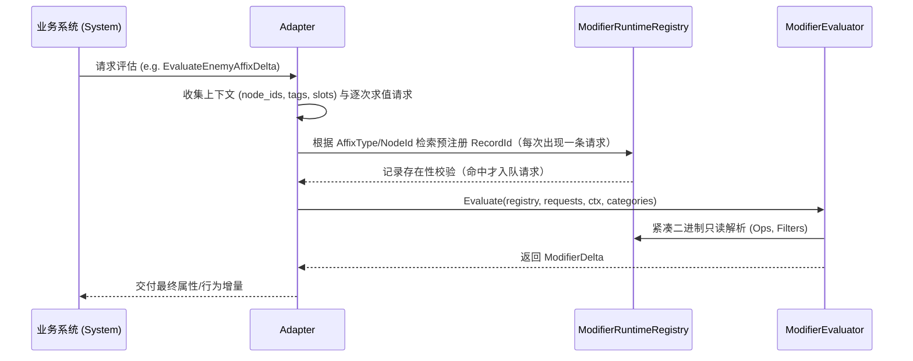

# UMR 统一修饰器运行时系统基础夯实与工程闭环设计

- **文档状态**：设计完成 / 待审阅
- **文档路径**：`docs/designs/2026-09-15-umr-foundation-and-pipeline-consolidation-design.md`
- **设计日期**：2026-09-15
- **系统代号**：`UMR` (Unified Modifier Runtime)
- **输入来源**：
  - `设计文档/统一修饰器运行时系统_UMR.md`（上游基线设计）
  - `docs/reviews/2026-09-15-design-doc-implementation-divergence-audit.md` §3.1、§4.2（当前架构审计与偏差清单）
  - `docs/reviews/2026-09-15-umr-foundation-and-pipeline-consolidation-design-review.md`（本设计第 1 轮审查，结论 `修改`，已按修订意见更新）
  - `docs/plans/2026-03-01-umr-phase2-release-checklist.md`、`docs/plans/2026-03-01-umr-phase3-legacy-removal-plan.md`

---

## 1. 背景与问题陈述

### 1.1 核心矛盾与任务来源
在 NoMoreDay 当前的研发推进中，存在一个核心架构抉择：
> **「装备、词缀、符文之语、星盘天赋、终局词缀等业务尚不完善，是先完善这些业务逻辑再抽离 UMR，还是先在现有基础上把 UMR 骨架修通并立下规范，后续内容直接在 UMR 体系上开发？」**

经过技术评估与 2026-09-15 的全库设计偏差审计，确定必须采用**「平台先行（Contract-First），在修通的 UMR 底座上直接开发业务」**，理由如下：
1. **避免双重开发与迁移地狱**：若在 C++ 散弹枪式实现几十种符文语与数百条词缀，事后抽离将面临庞大的代码重写与数值回归风险（如现存 `SkillSpecializationBaker.cpp` 248 处硬编码历史遗留）。
2. **防止周边数据结构持续割裂**：若 UMR 规范不尽早通电，周边系统（如物品存储、读档、网络同步）会继续遗漏 UMR 字段（例如新存储旁表 `ItemSideTableData` 丢失 `modifier_record_ids`）。
3. **UMR 地基实际已完成 75%**：Schema V2、二进制紧凑四表布局、多层乘区 Evaluator、怪物行为 21 个 OpCodes 均已跑通。当前不是从零造轮子，而是**修复几处关键断链与旁路**，工程量可控，收益巨大。

### 1.2 当前 UMR 实现的关键断层与缺陷（审计依据）
根据 `docs/reviews/2026-09-15-design-doc-implementation-divergence-audit.md` §3.1 与 §4.2，当前 UMR 存在以下 5 项致命阻断：
1. **构建与防漂移门禁断联（全链路未通电）**：
   - `scripts/gen_map_monster_modifier_v2.py:10-14` 引用的头文件路径（如 `src/game/data/MapAffix.hpp`、`src/game/components/Stats.hpp`）已因重构失效（实际位于 `src/game/foundation/...`），导致 `--check` 直接抛错崩溃。
   - `build.bat:268-287` 的 `ENABLE_PRECHECKS` 中**完全没有接入** UMR 相关校验脚本。
   - `scripts/gen_modifier_runtime_v2.py` 的 `--check` 参数实现为强制覆写产物，而非无副作用的漂移比对。
2. **适配器旁路与“死数据”断层**：
   - `MapModifierAdapter.cpp:75` 与 `MonsterModifierAdapter.cpp:200` 绕过 `ModifierRuntimeRegistry`，在 C++ 代码中临时构造 `ModifierRecord`。导致离线编译进 `modifier_runtime_v2.bin` 的海量 Map/Monster 数据成为无人按 ID 读取的“死数据”。
3. **求值器算子缺口（`MANA_COST_MULT` 静默失效）**：
   - `ModifierOpCode::MANA_COST_MULT`（枚举值 4）已在 `equipment_modifiers.json` 中配置，但 `ModifierEvaluator.cpp` 的两个 switch 中均无对应 case，直接命中 `default: break`（静默 no-op），且 `ModifierDelta` 缺少相应存储字段。
4. **物品存储轨数据丢失**：
   - `src/game/systems/item/storage/ItemStorageTypes.hpp` 中的存储旁表 `ItemSideTableData` 缺少 `modifier_record_ids` 字段，导致经仓储轨序列化/读档后，装备词缀与 UMR 彻底失联。
5. **业务数据配置层断档与节点 ID 漂移**：
   - `talent_modifiers.json` 的 `node_id_whitelist: [1100]` 指向不存在的节点（实际星盘 ID 区间为 1000~1044）。
   - 各域 JSON 仅有 1 条样例数据，缺乏标准扩展指南。

---

## 2. 目标、范围与非目标

### 2.1 核心目标（Goals）
1. **通电构建门禁与工具链修复**：修复生成脚本失效路径；为编译器增加真正的无副作用 `--check` 漂移比对；在 `build.bat` precheck 中强制挂接校验，阻断配置与代码漂移。
2. **求值算子闭环**：完善 `ModifierOpCode::MANA_COST_MULT` 的求值、结果存储与技能层接入。
3. **消除适配器内存自建旁路**：重构 `MapModifierAdapter` 与 `MonsterModifierAdapter`，打通其与 `ModifierRuntimeRegistry`（`modifier_runtime_v2.bin`）的真实 ID 检索流，消灭“死数据”。
4. **存储轨（Item Storage）字段对齐**：为 `ItemSideTableData` 补充 `modifier_record_ids` 序列化，确保物品进出仓库与读档后 UMR 修饰器完好保留。
5. **确立业务接入范式（Contract & Paradigm）**：制定装备词缀、符文之语、星盘天赋、终局词缀接入 UMR 的标准流程、ID 规划规则与范例。

### 2.2 范围外（Out of Scope）
- 本设计**不负责**一次性将全游戏 382 个技能专精全部迁移到 UMR（专精节点仍由现有的 `SpecState` / `SkillSpecializationBaker` 兜底，后续分批次平滑并轨）。
- 本设计**不涉及**具体的玩法平衡性数值调整。
- 本设计**不改变**现有 Schema V2 二进制的核心四表内存布局。

### 2.3 非目标（Non-Goals）
- 不在 UMR 内部实现复杂的图灵完备虚拟机。复杂的法术变形、特殊粒子触发、弹道逻辑仍然通过 OpCode 触发事件信号，交由具体游戏系统（如 `SkillSystem`、`MonsterAffixSystem`）执行。

---

## 3. 核心架构与系统设计

```mermaid
flowchart TD
    subgraph DataLayer [数据层 (assets/data/modifier_v2/)]
        A1[equipment_modifiers.json]
        A2[skill_spec_modifiers.json]
        A3[talent_modifiers.json]
        A4[map_modifiers.json]
        A5[monster_modifiers.json]
        A6[modifier_catalog.json]
    end

    subgraph Toolchain [编译器与门禁管线]
        B1[gen_map_monster_modifier_v2.py]
        B2[gen_modifier_runtime_v2.py]
        B3[check_monster_behavior_dispatch.py]
        B4[build.bat PRECHECK 门禁]
    end

    subgraph BinaryBlob [编译产物 (assets/generated/)]
        C1[(modifier_runtime_v2.bin)]
        C2[modifier_runtime_v2.debug.json]
    end

    subgraph RuntimeEngine [UMR 运行时层]
        D1[ModifierRuntimeRegistry: 二进制解析与四表索引]
        D2[ModifierEvaluator: 多层乘区计算与过滤]
        D3[ModifierDelta: 累积增量与行为事件集]
    end

    subgraph Adapters [标准化业务适配器]
        E1[EquipmentModifierAdapter]
        E2[SkillSpecModifierAdapter]
        E3[TalentModifierAdapter]
        E4[MapModifierAdapter]
        E5[MonsterModifierAdapter]
    end

    subgraph Systems [业务消费系统]
        F1[AttributePipeline: 属性结算]
        F2[SkillSystem: 魔耗与技能等级]
        F3[MonsterAffixSystem: 怪物行为分发]
        F4[ItemStorageService: 仓储持久化]
    end

    DataLayer --> B2
    B1 -->|自动生成/校验| A4
    B1 -->|自动生成/校验| A5
    B2 --> C1
    B2 --> C2
    B4 -->|触发拦截| B1
    B4 -->|触发拦截| B2
    B4 -->|触发拦截| B3

    C1 -->|EnsureLoaded 内存映射| D1
    E1 -->|查询 Record IDs| D1
    E2 -->|查询 Record IDs| D1
    E3 -->|查询 Record IDs| D1
    E4 -->|查询 Record IDs| D1
    E5 -->|查询 Record IDs| D1

    D1 --> D2
    D2 --> D3
    D3 --> F1
    D3 --> F2
    D3 --> F3
    E1 <-->|ItemSideTableData record_ids 持久化| F4
```

### 3.1 工具链修复与防漂移门禁体系

#### 3.1.1 生成脚本路径修复与契约
- **路径重构**：更新 `scripts/gen_map_monster_modifier_v2.py` 中的头文件路径映射：
  ```python
  MAP_AFFIX_HEADER = REPO_ROOT / "src/game/foundation/data/MapAffix.hpp"
  MAP_AFFIX_REGISTRY = REPO_ROOT / "src/game/systems/world/MapAffixRegistry.hpp"
  MAP_MODIFIER_ADAPTER = REPO_ROOT / "src/game/systems/modifier/MapModifierAdapter.cpp"
  MONSTER_AFFIX_REGISTRY = REPO_ROOT / "src/game/foundation/data/MonsterAffixRegistry.hpp"
  STATS_HEADER = REPO_ROOT / "src/game/foundation/components/Stats.hpp"
  ```
- **生成一致性校验**：`--check` 模式严格对比生成内容与磁盘现有文件，一旦存在未同步修改，必须以非 0 状态退出并打印 diff 差异，禁止静默通过。

#### 3.1.2 运行时二进制编译器的真正 `--check` 模式
- 修改 `scripts/gen_modifier_runtime_v2.py`：
  - `--check`：仅在内存中执行编译，将生成的内存 blob 与磁盘现存的 `assets/generated/modifier_runtime_v2.bin` 做字节级对比（CRC32 及 Byte-by-Byte）。若不一致，输出 `[modifier-runtime] Check failed: binary out of sync with modifier_v2 json` 并退出，**绝不在 check 模式下隐式覆写磁盘**。
  - 默认（无参数）与 `--build`：执行实际文件写入（生成入口）。
- **产物属性约束（重要）**：`assets/generated/modifier_runtime_v2.bin` 与 `modifier_runtime_v2.debug.json` 已被 `.gitignore:73` 显式忽略（"Generated modifier runtime artifacts"），属于**本地生成产物**，不随仓库分发。因此：
  - `build.bat` **不能**把 `.bin` 的 `--check` 当作硬失败门禁——任何未先生成产物的干净检出都会失败。
  - 正确做法是 `build.bat` 在 precheck 阶段**以写盘模式生成**该产物（确定性生成，耗时可忽略），从而"按构造保证"与 JSON 对齐。
  - `--check` 模式仍然实现并保留，用于 CI / 跨机比对，以及在产物改为纳入版本管理时的漂移检测。

#### 3.1.3 `build.bat` Precheck 门禁通电
在 `build.bat` 的 `ENABLE_PRECHECKS` 逻辑块中加入 UMR 专项防护网（沿用现有 `:run_quiet_step` 约定）：

```bat
REM 1) 校验受版本管理的 JSON 与 C++ 源码一致（真正的漂移门禁）
call :run_quiet_step "Validating Map/Monster modifier generation" "Map/Monster modifier drift detected!" "python scripts\gen_map_monster_modifier_v2.py --check"
if errorlevel 1 exit /b 1

REM 2) 校验怪物行为 opcode 分发契约
call :run_quiet_step "Checking monster behavior dispatch contract" "Monster behavior dispatch contract broken!" "python scripts\check_monster_behavior_dispatch.py"
if errorlevel 1 exit /b 1

REM 3) 生成运行时二进制产物（.bin 为 .gitignore 的本地产物，按构造保证与 JSON 对齐）
call :run_quiet_step "Generating modifier runtime binary" "Modifier runtime binary generation failed!" "python scripts\gen_modifier_runtime_v2.py"
if errorlevel 1 exit /b 1
```

- 第 1、2 道针对**受版本管理**的源（JSON / C++ 契约），构成真正的防漂移门禁。
- 第 3 道是**生成**步骤而非失败门禁：`.bin` 不随仓库分发，硬检测会让干净检出失败；生成后即与 JSON 对齐。`gen_modifier_runtime_v2.py --check` 保留供 CI / 跨机比对使用。

---

### 3.2 求值器补全：`MANA_COST_MULT` 闭环设计

#### 3.2.1 `ModifierDelta` 容器扩展
在 `src/game/systems/modifier/ModifierEvaluator.hpp` 中为 `ModifierDelta` 增加技能魔耗倍率存储：
```cpp
struct ModifierDelta {
  // ... 现有字段 ...
  std::unordered_map<uint32_t, float> mana_cost_mult; // key: skill_id (0 表示全局技能魔耗)

  void AddManaCostMultiplier(uint32_t skillId, float mult);
  [[nodiscard]] float GetManaCostMultiplier(uint32_t skillId) const;
};
```
- **乘算语义**：魔耗倍率为连乘模型（Compound Multiplier）。若初始值为 1.0f，叠加 0.9f（减 10% 耗蓝），结果为 `1.0 * 0.9 = 0.9`；若再来一条 0.8f，则为 `0.9 * 0.8 = 0.72`。
- **通配匹配**：`GetManaCostMultiplier(skillId)` 返回 `(ReadOr(mana_cost_mult, 0, 1.0f) * ReadOr(mana_cost_mult, skillId, 1.0f))`。

#### 3.2.2 `ModifierEvaluator::Evaluate` 算子补齐
在两个 `Evaluate` 重载函数的 `switch (op.opcode)` 中增加对应 case：
```cpp
case ModifierOpCode::MANA_COST_MULT:
  out.AddManaCostMultiplier(op.param_u32, op.param_f32);
  break;
```

#### 3.2.3 技能系统调用点接入（本阶段范围界定）
本阶段**只交付**：`MANA_COST_MULT` 的求值（3.2.2）与结果存储（3.2.1），以及配套单元测试。

技能消耗链的接线**不在本阶段交付物内**，原因：仓库当前不存在统一的技能魔耗结算点（无 `SkillSystem::CalculateManaCost` 之类的权威函数），耗蓝逻辑散落于 `BeamChannelDeliverySystem`（`effective_mana_cost`）与个别技能行为的 `skill->mana_cost`。在没有统一结算点时强行接线，只会产生"接在哪一处"的随意性与后续重复修改。

- 交付边界：`ModifierDelta::GetManaCostMultiplier(skillId)` 必须可用且被测试覆盖；`equipment_modifiers.json` 中的 `MANA_COST_MULT` 条目在求值层不再被静默丢弃。
- 后续任务（Out of Scope，登记为风险）：先确立唯一的技能魔耗结算函数，再由 `EquipmentModifierAdapter` 注入倍率；届时需以"倍率生效前后基础耗蓝对比"用例验收。

---

### 3.3 适配器重构：消灭旁路与打通 Registry

#### 3.3.1 问题本质剖析
当前 `MapModifierAdapter` 和 `MonsterModifierAdapter` 绕过了 `ModifierRuntimeRegistry`：
- 原因：过去二期重构时，为了单测快速跑通，在 Adapter 内部直接写死了 `ModifierRecord` 的内存组装，没有走“通过 NodeId / AffixId 从 Registry 索引表获取 RecordId”的官方路线。
- 危害：
  1. 编译出的 `map_modifiers.json` 和 `monster_modifiers.json` 二进制条目成了死数据。
  2. 每次计算时都在堆上动态构建 `std::vector<ModifierRecord>` 和 `std::vector<ModifierOp>`，产生额外的内存分配和 CPU 开销。

#### 3.3.2 标准适配器数据流（Standard Adapter Pattern）
所有 Adapter 统一遵循无堆分配或缓存式的查询流：



#### 3.3.3 前置解耦：生成器不得再从适配器源码提取映射（硬约束）

`scripts/gen_map_monster_modifier_v2.py:319-342` 的 `_parse_map_adapter_enemy_templates()` 目前以正则**从 `MapModifierAdapter.cpp` 的 `case MapAffixType::X:` 代码块**中提取 `MapAffixType -> StatType` 映射。这意味着"适配器源码"是生成器的输入契约：

- 若直接移除适配器 switch（原 3.3.3 的做法），Phase 1 刚通电的 `--check` 门禁会永久失败（抛 `RuntimeError`），构建自锁。
- 因此**必须先把映射迁出适配器**：在 `MapAffixDefinition` 上新增战斗属性字段（如 `StatType combatStat`），使其成为唯一事实来源；生成器改为解析 `MapAffixRegistry.hpp`，适配器改为读取 `MapAffixRegistry::GetDef(type).combatStat`。解耦完成后，适配器才允许不再持有硬编码 switch。
- 注意：生成器 `_parse_affix_definitions`（:309-316）依赖 `fields[5]` 取 `valT1`，新增字段的位置与数量必须同步更新解析索引，避免静默错位。

#### 3.3.4 地图修饰器适配器改造（`MapModifierAdapter`，在 3.3.3 解耦之后）

关键风险：运行期数值是**动态滚值**（`MapAffix::value` 按层级滚动），而 `map_modifiers.json` 中存放的是 `MapAffixRegistry` 的 **valT1 模板值**。若直接把求值切到 registry，会把所有地图词缀固定为 T1 强度（数值回归），且共鸣词缀（node `799999`，倍率 `resonance.totalEnemyDensity * 0.05f`）在 JSON 中无对应记录，会被静默丢弃。

因此改造必须建立"**记录形状来自 registry、数值来自运行时**"的双源模型：
1. `ModifierEvaluator` 增加"每次出现一个求值请求"的能力：
   ```cpp
   struct ModifierRecordRequest {
     uint32_t record_id = 0;              // 目标记录
     bool override_percent_mult = false;  // 是否覆盖该记录的乘算值
     float param_f32 = 0.0f;              // 运行时滚值
     uint32_t target_stat = 0xFFFFFFFFu;  // 覆盖作用的 StatType(op.param_u32)；通配=该记录全部乘算 op
   };
   // 新增重载（原有 recordIds 重载保留）
   ModifierDelta Evaluate(const ModifierRuntimeRegistry &registry,
                          std::span<const ModifierRecordRequest> requests,
                          const ModifierEvalContext &ctx,
                          ModifierOpCategory categories = ModifierOpCategory::All);
   ```
   语义：按 `requests` 顺序逐条施加，同一 `record_id` 出现 N 次就施加 N 次、各用自身 `param_f32`，叠加结果为 `(1+v1)*(1+v2)*...`；`override_percent_mult` 为真时仅覆盖 `op.param_u32 == target_stat` 的 `ADD_STAT_PERCENT_MULT` 算子（`target_stat` 为 `0xFFFFFFFF` 时覆盖该记录全部乘算算子）；记录本身（filter/ops 形状）仍只从 registry 只读解析。采用"请求"而非"按 id 覆盖表"，是因为 `explicitAffixes` 可合法包含同一 `MapAffixType` 多次且滚值不同，按 id 查表只能保留首条。
2. `ModifierOpCategory`（`None/Stats/Events/Behavior/All` 位掩码）在求值循环中跳过不相关算子组，供窄入口（如怪物行为系统每帧调用）避免为不消费的算子组做无序容器插入。
3. 适配器仅收集上下文（激活词缀类型 + 滚值），经 `MapModifierRegistry` 契约把 `MapAffixType` 映射为 `record_id` 与 `node_id`，再以逐次请求调用求值。
4. 共鸣词缀必须在 `map_modifiers.json` 中补齐独立记录（node `799999`），否则视为死数据遗漏。

#### 3.3.5 怪物修饰器适配器改造（`MonsterModifierAdapter`）

`MonsterModifierAdapter` 维持原有对外接口（`EvaluateAffixDelta`、`EvaluateAffixEvents`、`EvaluateBehaviorOps`）。

- 现三档语义由 `includeStats/includeEvents/includeBehaviorOps` 在内部逐 opcode 过滤决定，**不是**三条独立数据；改造时必须保留该过滤语义（已通过 `ModifierOpCategory` 类别掩码在求值循环中跳过无关算子组实现：属性入口传 `Stats|Behavior`、事件入口传 `Events`、行为入口传 `Behavior`），不得让某个入口返回全部字段。
- `Monster_Vampiric`（record 5001016）若同时含 `ADD_STAT_FLAT(LifeSteal)` 与行为 opcode `MONSTER_BEHAVIOR_VAMPIRIC_ON_HIT`，整条 record 求值会造成**吸血双计**。因此生成器必须与运行时语义对齐（Vampiric 不产出 LifeSteal 属性 op），适配器不再持有 `IsVampiricLifeStealStat` 之类的运行时特判——数据层是唯一事实来源，并由负例测试覆盖。
- 内部查询使用 `MonsterAffixType` 对应的静态 RecordId 列表走 Registry 检索，保证离线编译产物在运行期真实生效。

---

### 3.4 跨系统合同：物品存储轨对齐

#### 3.4.1 落点修正：`ItemSideTableData`（不是 `CompactAffix`）

原设计误将字段加在 `CompactAffix` 上。事实约束：
- `CompactAffix` 是 **8 字节 POD**（`static_assert(sizeof(CompactAffix) == 8)`），加入 `std::vector` 会破坏布局与断言，且违背存储轨"零堆分配"目标。
- 真实文件位于 `src/game/systems/item/storage/ItemStorageTypes.hpp`（原设计中的 `src/game/foundation/components/ItemStorageTypes.hpp` 不存在）。
- 变长/稀疏数据应挂载到旁表 `ItemSideTableData`，由持久化编解码器承载二进制。

```cpp
// src/game/systems/item/storage/ItemStorageTypes.hpp
struct ItemSideTableData {
    std::vector<StatConversion> conversions;
    std::vector<DamageModifier> damage_modifiers;
    std::vector<ItemSkillModifier> skill_modifiers;
    // 新增：持久化携带的 UMR 记录 ID 列表
    std::vector<uint32_t> modifier_record_ids;

    [[nodiscard]] bool empty() const noexcept {
        return conversions.empty() && damage_modifiers.empty() &&
               skill_modifiers.empty() && modifier_record_ids.empty();
    }
};
```

#### 3.4.2 转换协议与持久化保证

- 落点：`src/game/systems/item/storage/ItemPersistenceCodec.cpp` Section 3 `buildItemSideTablesSection`（编码）与 `SectionType::ItemSideTables`（解码）同步写入 / 读出 `modifier_record_ids` 的长度与 `uint32_t` 元素；`ItemStorageService` / `ItemStore` 的 side table 读写自然携带。
- 实体 ↔ 仓储转换处的语义（如实说明）：本阶段交付的是**旁表字段 + Section 3 编解码往返**。ECS 轨 `Affix.modifier_record_ids`（`src/game/foundation/components/ItemStats.hpp`）到存储轨 `ItemSideTableData.modifier_record_ids` 的桥接**尚未实现**，属双轨统一工作（T-P3-3）；当前该旁表字段为**前向兼容预留**，`ItemComponent -> CompactItem` 时不会自动落入、反向也不会还原。`Affix` 本身仍以 JSON 序列化承载该字段，不放入 `CompactAffix`。在存储轨内部，`ItemStorageService` / `SaveManager` 的 store 间复制已能保真该字段。
- 版本决定（最终结论）：`ITEM_STORE_BINARY_VERSION`（`ItemPersistenceCodec.hpp:27`）**已递增为 `2`，且不兼容 v1**。原因：本设计虽不改变 `ItemInstance` 布局，但 Section 3 每个条目新增了变长字段 `modifier_record_ids`（无逐条长度前缀），旧 v1 存档若按 v2 解码会在该段产生静默错位。由于解码器在 FileHeader 阶段即校验 `fileHeader.version != ITEM_STORE_BINARY_VERSION` 并直接失败，递增版本可安全地把 v1 存档挡在 Section 解码之前。本阶段不提供 v1 -> v2 迁移，仅以往返测试 + 版本拒绝用例覆盖。
- 添加双向往返序列化单测，杜绝存盘/读档后装备词缀 UMR 丢失。

---

### 3.5 业务系统接入范式（规范化指南）

为了让后续的装备、符文、天赋、终局词缀开发者有法可依，定义以下四大业务的接入标准：

```
+-------------------+--------------------+------------------------+---------------------------------------+
| 业务域 (Domain)   | ID 区间 (RecordId) | 存储配置文件           | 激活/过滤方式                         |
+-------------------+--------------------+------------------------+---------------------------------------+
| Equipment (装备)  | 1,000,000 ~        | equipment_modifiers.json | ItemComponent.modifier_record_ids 携带|
| SkillSpec (专精)  | 2,000,000 ~        | skill_spec_modifiers.json| node_id_whitelist 匹配已分配专精点   |
| Talent (星盘)     | 3,000,000 ~        | talent_modifiers.json  | node_id_whitelist 匹配星盘点亮节点   |
| Map (地图)        | 4,000,000 ~        | map_modifiers.json     | MapAffixType 编码匹配地图激活状态     |
| Monster (怪物)    | 5,000,000 ~        | monster_modifiers.json | MonsterAffixType 编码匹配精英怪词缀   |
| Runeword (符文)   | 6,000,000 ~        | runeword_modifiers.json| 符文镶嵌达成后挂载至装备词缀列表      |
| Endgame (终局)    | 7,000,000 ~        | endgame_modifiers.json | 梦魇/宿敌词缀转化为全局 Context 匹配  |
+-------------------+--------------------+------------------------+---------------------------------------+
```

#### 3.5.1 符文之语（Runewords）接入范式
- 符文之语本质上是一组预定义的修饰器组合。
- 在 `assets/data/modifier_v2/runeword_modifiers.json` 中配置属于符文之语的专属 Record 条目。
- 当 `RunewordSystem` 判定底材与符文镶嵌满足配方时，生成对应符文语的 `modifier_record_ids` 并注入到武器/护甲实体的 `ItemComponent` 中，自然走通 `EquipmentModifierAdapter`。

#### 3.5.2 星盘天赋（Talent）修复与接入范式
- 修正 `talent_modifiers.json` 中的错误节点 ID，将其重新对齐到 `profession_talents.json` 中的基础属性节点（区间 1000~1044）。
- 后续新增星盘数值节点时，直接在 `talent_modifiers.json` 登记一条包含目标 `StatType` 与 `node_id_whitelist` 的记录即可，无需编写任何 C++ 胶水代码。

---

## 4. 影响评估与技术风险

| 维度 | 影响分析 | 缓解措施与设计约束 |
| :--- | :--- | :--- |
| **构建性能** | `build.bat` 增加了三道 Python precheck 步骤 | Python 检查脚本均在 50~100ms 内完成，对整体构建耗时增加小于 0.3 秒。 |
| **运行时性能** | 移除 Adapter 临时堆内存构建，全部走 `span` 视图与常量只读二进制内存 | 预期降低每帧内存抖动（零 GC/零堆分配），提升 CPU 缓存局部性。 |
| **存档兼容性** | `ItemSideTableData` 增加了变长字段 | `ITEM_STORE_BINARY_VERSION` **已递增为 `2`，且不兼容 v1**：Section 3 布局变更后无逐条长度前缀，v2 解码器读 v1 存档会静默错位，故由 FileHeader 版本校验显式拒绝 v1；本阶段不做迁移，往返测试与版本拒绝用例覆盖。注：本阶段 `modifier_record_ids` 尚无 ECS→存储生产端（桥接属 T-P3-3），当前由 codec 编解码往返用例覆盖，字段为前向兼容预留。 |
| **配置防漂移** | 严格阻断未同步修改 | 编译器 `--check` 只读比对，CI 与本地 `build.bat` 构建直接把关，杜绝代码与数据脱节。 |

---

## 5. 验收标准与验证方案 (DoD)

### 5.1 自动化测试门禁 (Automated Verification)
1. **工具链与门禁通电**：
   - 执行 `python scripts/gen_map_monster_modifier_v2.py --check` 返回 0。
   - 执行 `python scripts/check_monster_behavior_dispatch.py` 返回 0。
   - 执行 `python scripts/gen_modifier_runtime_v2.py --check` 返回 0（测试故意修改 1 个 byte 后应返回 1 失败）。
   - 执行 `build.bat` precheck 阶段全部执行通过。
2. **单元与集成测试**：
   - 运行 `./bin/NoMoreDayTests.exe --test-case="*Modifier*"` 全部通过。
   - 运行 `./bin/NoMoreDayTests.exe --test-case="*MonsterAffix*"` 全部通过。
   - 运行 `./bin/NoMoreDayTests.exe --test-case="*ItemPersistence*"` 与 `--test-case="*ItemStore*"` 全部通过。
3. **新增功能与缺陷回归测试**：
   - `ModifierEvaluatorTests` 新增 `MANA_COST_MULT` 连乘及通配规则测试。
   - `ItemPersistenceCodecTests` 验证 `ItemSideTableData` 经 `ItemPersistenceCodec` Section 3 编解码往返后保留 `modifier_record_ids`（仅覆盖 codec 层；ECS `ItemComponent <-> CompactItem` 桥接尚未实现，属 T-P3-3）。
   - 验证 `MapModifierAdapter` / `MonsterModifierAdapter` 从 `ModifierRuntimeRegistry` 正常读取并生效。

### 5.2 交付产物清单
1. 修复后的 Python 脚本：`scripts/gen_map_monster_modifier_v2.py`、`scripts/gen_modifier_runtime_v2.py`。
2. 更新的构建脚本：`build.bat`。
3. 修正的核心代码：
   - `src/game/systems/modifier/ModifierEvaluator.{hpp,cpp}`（`MANA_COST_MULT` + `ModifierRecordRequest` + `ModifierOpCategory` 类别掩码）
   - `src/game/systems/modifier/ModifierContext.hpp`（`ModifierRecordRequest` / `ModifierOpCategory`）
   - `src/game/systems/world/MapAffixRegistry.hpp`（`MapAffixDefinition` 新增战斗属性字段，供生成器与适配器共用）
   - `src/game/systems/modifier/MapModifierAdapter.cpp`（去旁路 + 滚值逐次请求 + 常量漂移守护）
   - `src/game/systems/modifier/MonsterModifierAdapter.cpp`（直连 Registry + 保留三档过滤语义）
   - `src/game/systems/item/storage/ItemStorageTypes.hpp`（`ItemSideTableData.modifier_record_ids`）
   - `src/game/systems/item/storage/ItemPersistenceCodec.cpp`（Section 3 编解码）
4. 修正的数据与产物：
   - `assets/data/modifier_v2/talent_modifiers.json`（节点 ID 纠偏）
   - `assets/data/modifier_v2/map_modifiers.json`（补齐共鸣记录等）
   - `assets/generated/modifier_runtime_v2.bin` 与 `modifier_runtime_v2.debug.json`
5. 配套测试用例：
   - `tests/unit/ModifierEvaluatorTests.cpp`（`MANA_COST_MULT` 连乘/通配；`ModifierRecordRequest` 逐次覆写、同 record 多次叠加、`target_stat` 精确覆写、类别掩码跳过无关算子组）
   - `tests/unit/ItemPersistenceCodecTests.cpp`（含 `modifier_record_ids` 往返）
   - `tests/unit/MapModifierAdapterTests.cpp`、`tests/unit/MonsterModifierAdapterTests.cpp`（数值等价性回归、同词缀重复出现连乘、常量↔记录目标属性一致性、三入口互斥）

---

## 6. 实施路线建议（用于指导下阶段实施文档）

> 本节已按 2026-09-15 审查结论修订（详见 `docs/reviews/2026-09-15-umr-foundation-and-pipeline-consolidation-design-review.md`）：适配器去旁路必须排在"生成器与适配器解耦"之后，且地图数值需保留运行时滚值。

- **阶段一（P0 - 工具链与门禁通电）**：修复脚本路径；实现真正的只读 `--check` 并明确默认模式写盘语义；接入 `build.bat`；补齐门禁负例（篡改 JSON / 篡改 `.bin` 各一次）。
- **阶段二（P0 - 算子补齐与存储轨打通）**：补齐 `MANA_COST_MULT` 求值与存储；`ItemSideTableData.modifier_record_ids` + Section 3 编解码往返。技能消耗链接线明确列为后续任务。
- **阶段三（P1 - 契约解耦与适配器闭环）**：
  - 3.0 生成器与适配器解耦（`MapAffixDefinition` 承载战斗属性映射，生成器不再解析适配器源码）。
  - 3.1 怪物适配器直连 Registry，保留三档过滤语义并与生成器对齐 Vampiric 语义。
  - 3.2 地图适配器直连 Registry，以 `ModifierRecordRequest` 逐次注入分层滚值，补齐共鸣记录。
- **阶段四（P1 - 数据修正与全面回归）**：修正 `talent_modifiers.json` 节点 ID，重编 `.bin`，跑通门禁与全量单测，并对地图/怪物数值做改造前后等价性对比。

## 7. 审查修订记录

- 2026-09-15 第 1 轮审查：结论 `修改`。修订 §3.2.3（技能消耗链 scope-out）、§3.3.3（新增生成器解耦硬约束）、§3.3.4（地图滚值 override 模型）、§3.3.5（怪物三档语义与吸血双计）、§3.4（落点改为 `ItemSideTableData` + 版本决定）、§5.2（交付物路径）、§6（阶段顺序）。
