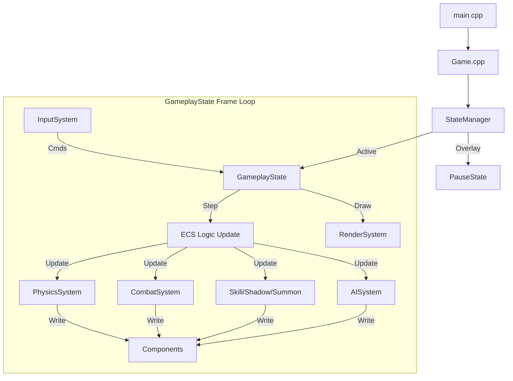
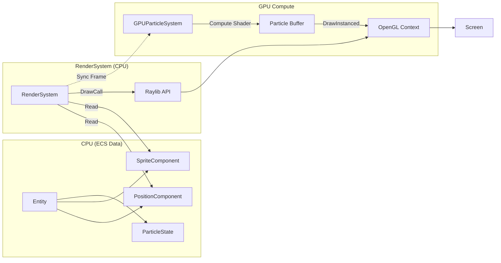

# NoMoreDay - Code Structure & Architecture

This document provides a high-level overview of the `NoMoreDay` codebase to assist with rapid understanding of the project structure, module responsibilities, and system interactions.

## 1. Top-Level Directory Structure

*   **`src/`**: The core C++ source code for the game engine and gameplay logic.
*   **`assets/`**: Game assets including textures, shaders (glsl), data files (JSON), and fonts.
*   **`scripts/`**: Automation scripts (mostly Python) for asset processing, tag generation, etc.
*   **`conductor/`**: Project management specific files (tracks, plans).
*   **`tests/`**: Unit and integration tests using GoogleTest/Doctest.
*   **`third_party/`**: External libraries (Raylib, EnTT, Taskflow, spdlog, etc.).
*   **`build/`**: CMake build artifacts.
*   **`设计文档/`**: Design documents and specifications.

## 2. Source Code (`src/`) Breakdown

The source code is organized into layers, from low-level infrastructure to high-level game logic.

### 2.1. `app/` - Application Entry
Contains the main entry point and high-level application flow.
*   `main.cpp`: Entry point. Initializes the `Game` instance.
*   `Game.cpp/hpp`: Main game loop, manages `SharedContext`, window initialization (via Raylib), and state machine updates.
*   `SharedContext.hpp`: Shared data accessible across states (Registry, Dispatcher, Lua, Resources).

### 2.2. `core/` - Infrastructure / Utilities
Foundation layer providing common utilities independent of the game logic.
*   **`logging/`**: `Logger`, `CrashHandler` (Spdlog wrapper).
*   **`math/`**: Math utilities, UUID generation.
*   **`threading/`**: Thread pool or concurrency primitives (Taskflow integration).
*   **`utils/`**: General purpose helpers (FrameRateUtils, etc.).

### 2.3. `engine/` - Core Subsystems
Low-level engine systems that handle technical operations usually agnostic of specific gameplay rules.
*   **`render/`**: Rendering pipeline.
    *   `RenderSystem`: Main ECS render logic.
    *   `GPUParticleSystem` / `GPUFlowFieldSystem`: Compute shader-based visual systems.
    *   `UIRenderer`: UI rendering.
*   **`input/`**: `InputSystem` - handling keyboard/mouse state mapping.
*   **`physics/`**: `PhysicsSystem` - Collision detection (SpatialHashGrid), movement integration.
*   **`resource/`**: `ResourceManager`, `AssetLoadingSystem`. Handles async loading of textures, shaders, JSONs.
*   **`audio/`**: `AudioSystem` (Raylib wrapper), DynamicMixer, SoundRegistry.
*   **`scene/`**: `SceneManager`, `StateManager`. Manages the stack of GameStates (Menu -> Game -> Pause).

### 2.4. `game/` - Gameplay Logic (ECS)
The bulk of the specific game logic, built primarily on the EnTT ECS architecture.

#### 2.4.1. `states/` - Game States
Classes corresponding to different screens/modes of the application.
*   `GameplayState`: The actual game loop. Initializes level, entities, and runs the update loop.
*   `MainMenuState`, `PauseState`, `SettingsState`, `InventoryState`, `LoadingState`.
*   `MosaicEditorState`: 3x3 维度拼图编辑器界面。
*   `HeirloomVaultState`: 传家宝仓库与选择界面。

#### 2.4.2. `components/` - ECS Components (Data)
POD (Plain Old Data) structs attached to entities.
*   **`Common.hpp`**: `Position`, `Velocity`, `Sprite`, `IDComponent`.
*   **`Stats.hpp`**: `Health`, `Mana`, `CombatStats`, `Damage` modifiers.
*   **`MapComponent.hpp`**: `PortalComponent`, `TownPortalCastingComponent`, `MapTileComponent`, `VisibilityComponent`.
*   **`MapFragmentComponent.hpp`**: 地图碎片数据（类型、元素、词缀属性、共鸣效果）。
*   **`SkillDefs.hpp`**: `SkillCooldowns`, `ActiveSkills`, `SummonComponent`, `ShadowComponent`.
*   **`ItemComponent.hpp`**, `InventoryComponent.hpp`, `EquipmentComponent.hpp`.
*   `HeirloomComponent.hpp`: 传家宝属性与状态（层级、原始等级）。
*   **`AIComponent.hpp`**: State data for enemy AI (includes `NEMESIS_HUNTER` mode).
*   **`NemesisComponent.hpp`**: Persistent data for Nemesis (tier, affixes, resistances).
*   **`EliteModifierComponents.hpp`**: Data for `SoulLink`, `Avenger`, `StealthedTag`, and `TankBlockingTag`.
*   **`Combat.hpp`**: `AttackState`, `DamageEvent`.

#### 2.4.3. `systems/` - ECS Systems (Logic)
Systems that iterate over entities with specific components to execute logic.
*   **`combat/`**:
    *   `CombatSystem`: Hit detection resolution, basic damage application.
    *   `DamagePipeline`: Complex damage calculation (Mitigations, Crits, Elemental, Armor).
    *   `StatsSystem`: Synchronizes base stats with modifiers (Talents, Gear).
    *   `CombatEventDispatcher`: Event bus for combat triggers (OnHit, OnKill, OnCrit).
    *   `VisualFXSystem`: Handles visual feedback for combat events (particles, screen shake) decoupled from logic.
    *   `EffectSystem`: Status effects (DoT, Buffs).
*   **`skill/`**:
    *   `SkillSystem`: Manages skill triggers, cooldowns, and input handling.
    *   `ShadowSystem`: Manages "Shadow/Afterimage" delayed skill mimicry.
    *   `SummonSystem`: Manages summons (Spirit Swords) AI and lifetime.
    *   `ProjectileSystem`: Updates projectile movement, collision, and piercing logic.
    *   `behaviors/`: Specific implementation logic for different skills (e.g., `BladeFormation`, `FlowingThrust`).
*   **`ai/`**: `AISystem`, `EnemyBehavior`. Handles enemy pathfinding and decision making (Supports `Support`, `Assassin`, `Tank` archetypes).
*   **`combat/`**:
    *   `EliteModifierSystem`: Manages elite modifiers like `SoulLink` (damage sharing) and `Avenger` (stat stacking on ally death).
*   **`item/`**: `InventorySystem`, `DropSystem`, `LootFilter`, `FragmentDropSystem` (处理碎片延迟生成队列), `HeirloomScaling` (传家宝动态压缩算法).
*   **`world/`**:
    *   `MapSystem`: Level generation/management.
    *   `PortalSystem`: Handles teleportation logic (Town Portal, Dungeon Exit) and visual effects.
    *   `MosaicMapGenerator`: 基于维度拼图结果的程序化地图生成。
    *   `FogOfWarSystem`: Visual obscuration.
    *   `EnemySpawnSystem`: Spawning rules (应用维度共鸣加成).
    *   `CorruptionSystem`: 腐化值管理与全局难度动态调整。
*   **`nemesis/`**:
    *   `NemesisGenerator`: Dynamically creates Nemesis enemies based on kill history and player build.
    *   `FactionAggroSystem`: Tracks player hostility toward factions and triggers Nemesis spawns.
*   **`progression/`**:
    *   `LeaderboardSystem`: 记录无尽模式最高层数与 DPS 峰值，支持本地持久化。
    *   `AchievementSystem`: 数据驱动的成就系统，支持条件触发与 UI 通知。
*   **`ui/`**: `UISystem`, `PlayerHUD`, `UIInventory`, `UISkillTalentTree`. Updates UI data based on ECS state.

#### 2.4.4. `data/` - Data Definitions
Registries and loaders for static game data (often loaded from JSON).
*   `SkillRegistry`, `BuffRegistry`, `TagRegistry`.
*   `MosaicData.hpp`: 维度网格数据结构与进度管理。
*   `ResonanceCalculator.hpp`: 相邻/连线/全满共鸣算法。
*   `NemesisDataStore`: Singleton for persisting Nemesis state across runs.

## 3. Module Interactions & Architecture

### 3.1. Entity Component System (EnTT)
*   **Entities** are just IDs.
*   **Components** hold data (e.g., `Position`, `Health`).
*   **Systems** hold logic. The `Game` loop calls `System::Update(registry, dt)`.
    *   *Example*: `PhysicsSystem` reads `Velocity` and updates `Position`. `RenderSystem` reads `Position` and draws the sprite.

### 3.2. State Management
*   The `Game` class owns a `StateManager`.
*   `StateManager` maintains a stack of `State` objects.
*   Only the top state is processed for Input/Update, though rendering might cascade (e.g., Pause overlay on top of Game).

### 3.3. Rendering Flow
*   Main Logic Update -> ECS Systems calculate new state.
*   `RenderSystem` iterates over renderable entities.
*   Lower-level `Raylib` calls are made to draw frames.
*   **Compute Shaders**: `GPUParticleSystem` uses OpenGL compute shaders for high-performance visual effects, synchronized with game state.

### 3.4. Input Handling
*   `InputSystem` polls hardware.
*   States (like `GameplayState`) query `InputSystem` to dispatch commands (e.g., "Cast Skill 1").

### 3.5. Event System
*   Used primarily in Combat.
*   `CombatEventDispatcher` allows systems to subscribe to events like `OnDealDamage`, `OnKill`, or `OnSkillHit` without tight coupling.
*   **VisualFXSystem** listens to these events to spawn particles, ensuring visual logic doesn't clutter gameplay code.

## 4. Key Files for Quick Navigation
*   **Main Game Loop**: `src/app/Game.cpp`
*   **Combat Logic**: `src/game/systems/combat/DamagePipeline.cpp`
*   **Skill Definitions**: `src/game/systems/skill/behaviors/`
*   **Shadow Logic**: `src/game/systems/skill/ShadowSystem.cpp`
*   **Visuals**: `src/game/systems/combat/VisualFXSystem.cpp`
*   **Entity Registration (Save/Load)**: `src/systems/SerializationSystem.hpp`
*   **Defines/Config**: `src/pch.hpp` (Precompiled Header), `CMakeLists.txt`

## 5. System Interaction Diagrams (Mermaid)

### 5.1 Core Architecture & Loop

### 5.2 Combat & Damage Flow

```mermaid
sequenceDiagram
    participant Player
    participant Input as InputSystem
    participant Skill as SkillSystem
    participant Proj as ProjectileSystem
    participant Phys as PhysicsSystem
    participant Dmg as DamagePipeline
    participant Event as CombatEventDispatcher
    participant VFX as VisualFXSystem
    participant Stats as StatsSystem

    Player->>Input: Press Key
    Input->>Skill: Trigger Action
    Skill->>Proj: Spawn Projectile
    Proj->>Phys: Move & Detect Collision
    Phys->>Dmg: Impact Detected
    
    rect rgb(50, 20, 20)
        note right of Dmg: Damage Calculation
        Dmg->>Dmg: Base Dmg + Modifiers
        Dmg->>Dmg: Crit Calculation
        Dmg->>Stats: Check Defense/Resist
    end
    
    Dmg->>Event: Dispatch OnDealDamage/OnHit
    par Logic
        Event-->>Skill: Trigger OnHit Effects (e.g. Lifesteal)
    and Visuals
        Event-->>VFX: Spawn Hit Particles
    end
    
    Dmg->>Stats: Deduct Health
    
    alt Target Dead
        Dmg->>Event: Dispatch OnKill
        Event-->>Stats: Grant XP / Loot
    end
```

### 5.3 Rendering Pipeline (CPU + GPU)

