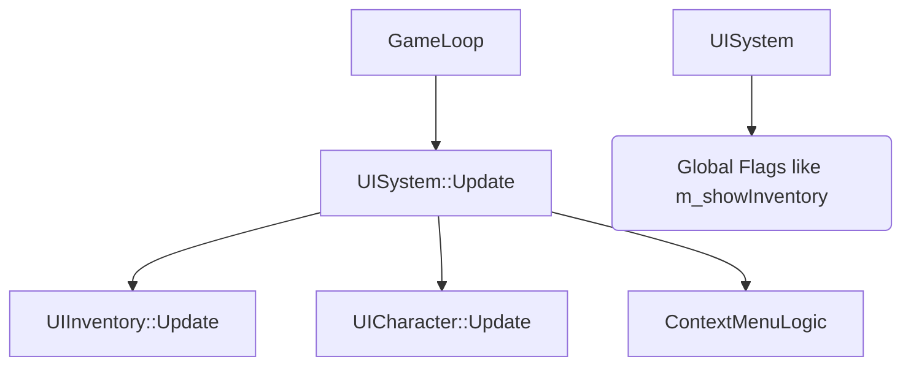

# NoMoreDay - UI 系统重构方案 (UI System Refactoring Plan)

## 1. 背景与目标 (Background & Goals)

当前 `UISystem` 是一个包含了背包、角色面板、小地图、Tooltip、右键菜单等所有逻辑的静态单例类。随着 `StateManager` (状态机) 的引入，我们需要将 UI 的控制权从“巨型 System”转移到具体的“游戏状态 (State)”中，以实现以下目标：

- **状态驱动 (State-Driven)**：由 `InventoryState` 负责背包的更新与渲染，而不是在 `GameplayState` 中通过 `if (showInventory)` 来判断。
- **逻辑解耦 (Decoupling)**：背包打开时，自动暂停底层的战斗逻辑 (CombatSystem)，通过状态栈 (State Stack) 的机制天然实现，无需手动 hack。
- **服务化 (Service-Oriented)**：将 `DrawSlot`, `DrawText` 等通用绘图功能提取为无状态的工具库 `UIRenderer`。

## 2. 核心架构演进 (Architecture Evolution)

### 2.1 现状 (Current)

*缺点：所有 UI 逻辑混杂，通过大量布尔值控制显示/隐藏，难以处理复杂的输入遮挡（如打开背包时禁止移动）。*

### 2.2 目标 (Target)
```mermaid
graph TD
    Application --> StateManager
    
    subgraph Stack
        InventoryState
        GameplayState
    end
    
    StateManager --> InventoryState::Update
    StateManager --> GameplayState::Render (Background)
    StateManager --> InventoryState::Render (Overlay)
    
    InventoryState --> UIInventory::Logic
    InventoryState --> UIRenderer(Drawing Helpers)
    
    GameplayState --> CombatSystem
    GameplayState --> PhysicsSystem
```
*优点：`InventoryState` 位于栈顶时，可拦截 Input，阻止 `GameplayState` 的 Update，同时允许 `GameplayState` 继续 Render 保持背景可见。*

## 3. 重构详细设计 (Detailed Design)

### 3.1 拆分 `UISystem` -> `UIRenderer` + `UIContext`

将 `UISystem` 中的**绘图功能**与**状态数据**分离。

#### `UIRenderer` (Stateless Helper)
纯静态工具类，负责“怎么画”，不负责“画什么”。
- `DrawSlot(pos, item, ...)`
- `DrawTextUI(...)`
- `DrawPanel(...)`
- `GetRarityColor(...)`

#### `UIContext` (Shared Data)
存放跨 UI 共享的数据（如 Tooltip 内容、拖拽中的物品、全局字体引用）。
- `Font globalFont`
- `Entity draggingItem`
- `ContextMenuState`

### 3.2 引入 `InventoryState`

创建一个继承自 `IState` 的新类 `InventoryState`。

- **OnEnter()**: 
  - 初始化背包 UI 布局。
  - 播放“打开背包”音效。
- **OnUpdate(dt)**: 
  - 处理鼠标点击槽位、拖拽。
  - 处理 ESC 键 -> `StateManager::PopState()`。
  - **Return false**: 阻止底层 (GameplayState) 更新。
- **OnRender()**:
  - 绘制半透明黑色遮罩 (`DrawRectangle(0,0,w,h, Fade(BLACK, 0.5f))`)。
  - 调用 `UIInventory::Draw(registry)`。
  - 调用 `UIRenderer::DrawContextMenu()` (如果激活)。
  - 调用 `UIRenderer::DrawTooltip()`。

### 3.3 修改 `GameplayState`

- 移除对 `UISystem::Update` 的全量调用。
- 监听输入：
  ```cpp
  if (IsKeyPressed(KEY_I) || IsKeyPressed(KEY_TAB)) {
      stateManager->PushState(std::make_unique<InventoryState>(context));
  }
  ```
- 仅保留 HUD (Head-Up Display) 的渲染（血条、小地图），这些属于 `GameplayState` 的一部分，不属于 `InventoryState`。

## 4. 迁移步骤 (Migration Steps)

1.  **提取绘图层**：将 `UISystem` 中的 `DrawSlot`, `DrawTextUI` 等函数移动到 `src/core/UIRenderer.hpp/cpp`。
2.  **创建 UI 上下文**：定义 `UIContext` 结构体，放入 `SharedContext` 中，供各 State 访问。
3.  **实现 `InventoryState`**：
    - 复制 `UIInventory` 的核心逻辑到 `InventoryState`。
    - 确保在此状态下，InputSystem 不会被 `GameplayState` 处理。
4.  **清理旧代码**：逐步废弃 `UISystem` 中的 `Update` 逻辑，将其拆散分发到 `HUD` (在 GameplayState 中) 和 `InventoryState` 中。

## 5. 交互与事件 (Interaction & Events)

为了解决 UI 操作（如“穿上装备”）需要修改底层 ECS 数据的问题：
- **方案 A (Direct Access)**: `InventoryState` 持有 `entt::registry` 指针，直接修改组件 (ItemComponent, EquipmentComponent)。*（推荐，简单高效）*
- **方案 B (Event Bus)**: UI 发送 `EquipEvent`，由 `InventorySystem` (ECS System) 监听并处理。

**建议采用方案 A**，因为 UI 操作本质上就是数据的变更，直接操作 Registry 符合 ECS 模式，只要逻辑封装得当（例如使用 `ItemFactory` 或 helper 函数）。
