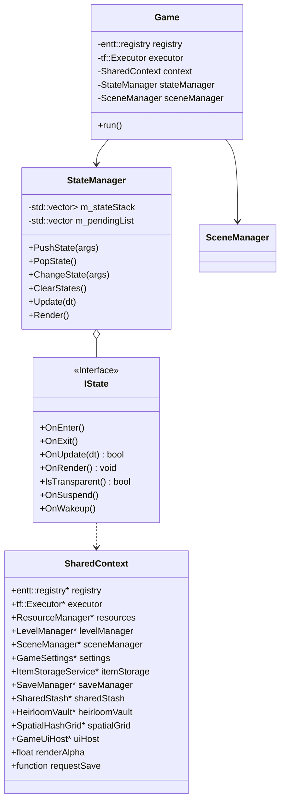

# NoMoreDay - 游戏流程与状态管理系统设计 V0.1

## 1. 设计目标 (Design Goals)

- **解耦 (Decoupling)**：将“主菜单”、“核心战斗”、“暂停”、“加载”等逻辑完全分离。
- **堆栈式管理 (Stack-Based)**：支持状态叠加（Overlay），例如在游戏画面上直接叠加半透明的暂停菜单或背包界面，而无需销毁游戏场景。
- **ECS 集成**：确保 EnTT 的 `Registry` 和 Taskflow 的 `Executor` 仅在正确的状态下运行，最大化性能。
- **RAII 资源管理**：利用 C++20 智能指针管理状态生命周期，防止内存泄漏。

## 2. 核心架构 (Core Architecture)

### 2.1 类结构图



### 2.2 核心组件定义

#### `SharedContext` (上下文)
一个轻量级结构体，包含游戏运行所需的全局单例引用。避免了全局变量的使用，便于单元测试和依赖注入。

#### `StateManager` (状态管理器)
- **Update 逻辑**：通常只更新栈顶状态 (`stack.back()->OnUpdate(dt)`)。
- **Render 逻辑**：从栈底向栈顶绘制。这允许“暂停状态”拥有透明背景，从而透视出底层的“游戏状态”。
- **Pending Changes**：状态的切换（Push/Pop）不应在 Update 循环中立即执行，而是存入 `m_pendingList`，在帧结束时统一处理，避免迭代器失效。

## 3. 状态清单 (State List)

### 3.1 `IntroState` (开场)
- **职责**：显示 Logo，预加载核心配置 (Config) 和基础资源 (Fonts, UI Textures)。
- **逻辑**：播放淡入淡出动画 -> 切换至 `MainMenuState`。

### 3.2 `MainMenuState` (主菜单)
- **职责**：开始游戏、继续游戏、设置、退出；通过检测 `saves/slot_0.nmd` 是否存在决定是否启用“继续”。
- **ECS**：通常不需要 ECS，或者仅运行一个轻量级的 UI System。
- **背景**：可以是静态图，也可以是一个简化的 3D/2D 场景渲染（展示动态背景）。
- **流程**：新建或继续游戏时切换至 `LoadingState` 执行关卡准备；“继续”在加载回调中调用 `SaveManager::loadCharacter` 恢复存档，随后进入 `GameplayState`。

### 3.3 `GameplayState` (核心玩法)
- **职责**：**NoMoreDay** 的核心。
- **OnEnter**:
  - 加载关卡数据 (MapSystem)。
  - 初始化 ECS 系统 (Physics, Combat, AI)。
  - 构建 Taskflow 任务图 (Task Graph)。
- **OnUpdate**:
  - 运行 `taskflow.run(executor)`。
  - 处理实时输入 (InputSystem)。
- **OnRender**:
  - 调用 `RenderSystem`。
- **OnSuspend** (被暂停覆盖时):
  - 停止 Taskflow 调度。
  - 可以在此处截取当前帧作为背景图（如果不需要实时背景）。

### 3.4 `PauseState` 与 UI 叠加层
- **`PauseState` (暂停)**：叠加在 `GameplayState` 之上的透明状态，`OnUpdate` 返回 `false` 以阻止底层更新；菜单包含继续、脱离卡死、设置、返回主菜单。
- **背包等 UI 叠加层**：由 `GameUiHost` 直接托管的 UI 面板，不作为独立 `IState`；背包面板在 `GameplayState` 中由按键（`I` / `Esc` / `Tab`）切换显示，游戏世界保持运行。
- **特性**：
  - **透明背景**：渲染时会先画下面的 GameplayState，再画一个半透明黑色遮罩，最后画 UI。
  - **输入独占**：暂停状态下拦截所有输入，防止角色继续移动。
  - **时间冻结**：`GameplayState` 的 Update 不会被调用，因此 `DeltaTime` 对游戏逻辑为 0。

### 3.5 `LoadingState` (加载)
- **职责**：以异步任务方式执行一次性加载，完成后切换到目标状态。
- **构造**：接收加载任务 (`LoadTask`) 与完成回调 (`OnComplete`)。
- **逻辑**：`OnEnter` 通过 `std::async` 启动加载任务；`OnUpdate` 轮询任务完成，完成后执行回调并结束自身；`OnRender` 显示 `LOADING...` 文本与旋转指示块。
- **与 SceneManager 的分工**：场景切换（如穿越传送门）由 `SceneManager` 负责（淡出/加载/淡入过渡与异步关卡加载），不经由 `LoadingState`；`LoadingState` 用于状态级切换（如主菜单新建/继续游戏）。

### 3.6 `SettingsState` (设置)
- **职责**：提供 Gameplay / Graphics 两类设置界面，调节缩放、震屏与渲染质量档位，并切换 V3、簇光照、法线光照、高光等图形选项。
- **数据**：直接读写 `GameSettings` 并即时生效。

### 3.7 `HeirloomVaultState` (传家宝宝库)
- **职责**：开局前展示可用的传家宝，允许选择一件带入新游戏。
- **特性**：半透明覆盖层（`IsTransparent()` 返回 `true`），通过 `getSelectedIndex()` 向调用方返回选择结果。

### 3.8 `DimensionalLevelSelectState` (维度层数选择)
- **职责**：在 1–100 范围内选择维度起始层数并确认生成。

### 3.9 `MosaicEditorState` (马赛克编辑器)
- **职责**：在每层结束时将收集的碎片放入 3×3 网格以构建下一层地图，并预览共鸣、词缀与难度。
- **特性**：半透明覆盖层（`IsTransparent()` 返回 `true`）。

### 3.10 `NightmareFloorState` (无尽梦魇层间过渡)
- **职责**：显示当前层数、腐化值与下一层难度预览，并推进至下一层。
- **特性**：半透明覆盖层（`IsTransparent()` 返回 `true`），经过展示时间后自动推进。

## 4. C++20 实现细节建议

### 4.1 状态接口

```cpp
class IState {
public:
    virtual ~IState() = default;
    virtual void OnEnter() {}
    virtual void OnExit() {}
    
    // 返回 false 表示阻止底层状态更新
    virtual bool OnUpdate(float dt) = 0; 
    virtual void OnRender() = 0;
    
    // 是否透明：透明状态允许栈底画面透出（叠加层）
    virtual bool IsTransparent() const { return true; }
    
    virtual void OnSuspend() {}
    virtual void OnWakeup() {}
};
```

### 4.2 状态工厂与转换
为了避免头文件循环依赖，可以使用 `StateID` 枚举配合工厂模式，或者直接使用 `std::function<std::unique_ptr<IState>()>` 来创建新状态。

### 4.3 与 Taskflow 的集成
`GameplayState` 应持有自己的 `tf::Taskflow` 对象。
- **Enter**: 构建 `tf::Taskflow` 图（Input -> Physics -> AI -> ...）。
- **Update**: `executor.run(taskflow).wait();` (或者使用异步 `run` 并在下一帧 `wait` 以利用帧间并行，但在游戏循环中通常为了同步逻辑选择 `wait`)。

## 5. 目录与文件位置

- `src/game/application/scene/State.hpp`：`IState` 状态接口。
- `src/game/application/scene/StateManager.hpp`：`StateManager` 状态栈与延迟切换。
- `src/game/application/scene/SceneManager.hpp`：场景过渡与关卡加载。
- `src/game/application/states/`：具体状态实现（`MainMenuState`、`GameplayState`、`PauseState`、`SettingsState`、`LoadingState`、`HeirloomVaultState`、`DimensionalLevelSelectState`、`MosaicEditorState`、`NightmareFloorState`）。
- `src/game/foundation/SharedContext.hpp`：`SharedContext` 定义。
- `src/app/Game.hpp` / `src/app/Game.cpp`：游戏主循环与状态管理器持有者。